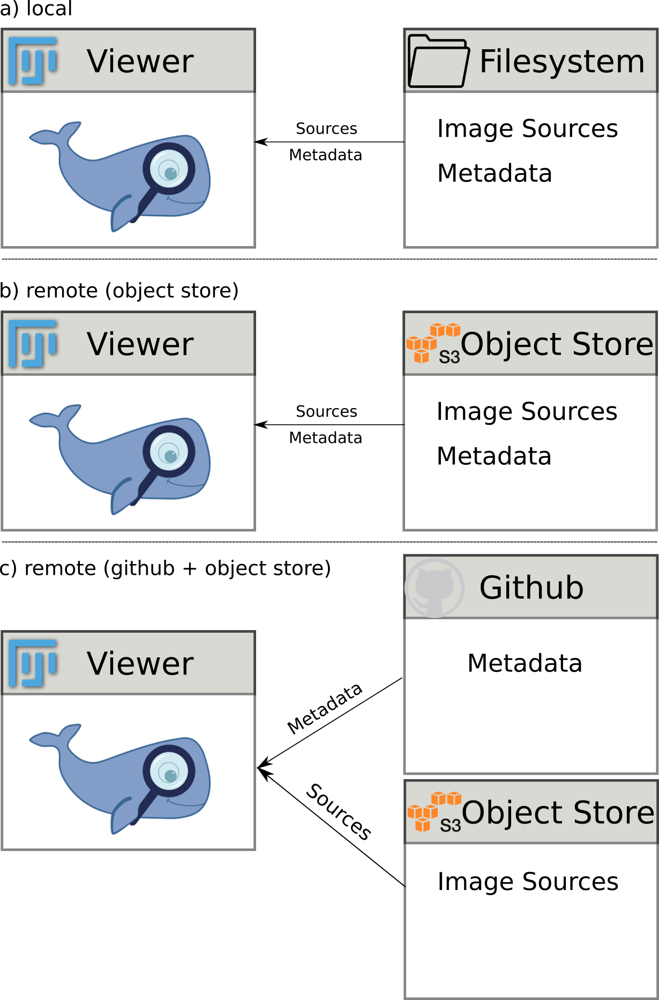

# MoBIE project and dataset specification

A `project` groups data, for example from the same series of experiments, that can be accessed by the MoBIE viewer. It must contain at least one `dataset`.
A `dataset` contains data that can be explored *jointly* in the MoBIE viewer.

## Project

The `project` and its associated `datasets` are stored in a directory structure with the project corresponding to the root directory.
This directory must contain a `datasets.json` file, which lists the available datasets and specifies the default dataset, 
which will be opened when starting the MoBIE viewer for this project. The project must contain at least one dataset directory.
The dataset directory names and the names in `datasets.json` must be identical.

Below you can find an example directory structure and the corresponding `datasets.json`.
This example was slightly adapted from the [zebrafish-lm project](https://github.com/mobie/zebrafish-lm-datasets).

```
zebrafish-lm/
├── datasets.json  # contains list of available datasets and the default dataset
├── actin
├── cisgolgi
├── lysosomes
├── membrane
├── nuclei
└── trans_golgi
```

```json
{
  "datasets": [
    "actin",
    "cisgolgi",
    "lysosomes",
    "membrane",
    "nuclei",
    "trans_golgi"
  ],
  "defaultDataset": "membrane"
}
```

## Dataset

TODO add spec once changes to views / bookmarks are done
explain the difference between image sources and metadata

TODO this will partly change now with the changes discussed for the bookmark / view layout,
which will be relevant for images.json and bookmarks

```
actin/
├── images
│   ├── images.json
│   ├── local
│   └── remote
├── misc
│   └── bookmarks
└── tables
    ├── membrane-00E41C184C_lynEGFP_seg
    ├── membrane-2BDB74A7D6_lynEGFP_seg
    └── membrane-F80ACE04D5_lynEGFP_seg
```

The specification for metadata and tables [can be found here](./metadata_and tables).

## Local & remote storage

MoBIE projects can be either stored locally or hosted on a remote object store.
Currently, MoBIE supports the following storage options:
- filesystem: supports image sources and metadata
- s3 object store: supports image sources and metadata; public and private buckets are supported
- github: supports metadata, image sources must be loaded from object store

This enables different combinations of hosting a project, see also the figure below:
<ol type="a">
<li>only on filesystem: project is only available locally; this is the best mode for development.</li>
<li>only on s3 object store: project is self-contained in object store and can be shared with collaborators privately (using a privat bucket) or shared publicly (using a public bucket).</li>
<li>on github and s3 object store: the metadata is stored on github, which also serves as entrypoint for the viewer. The image sources are stored on the s3 bucket. This set-up has the advantage that metadata is under version control.</li>
</ol>


