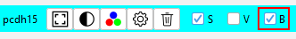
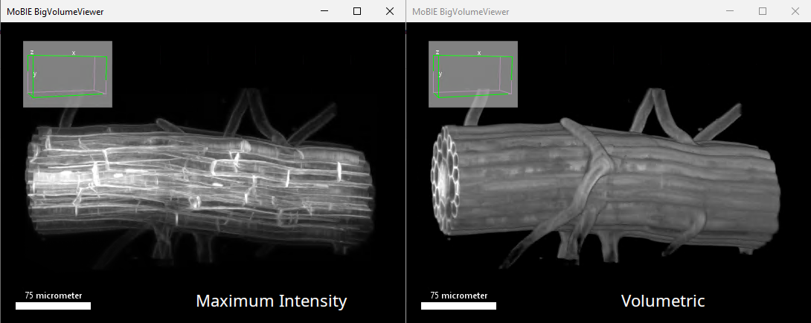
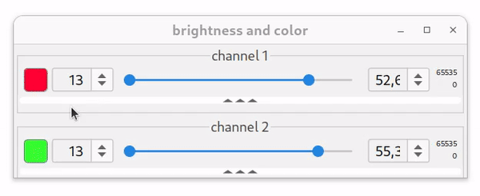
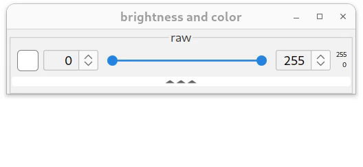
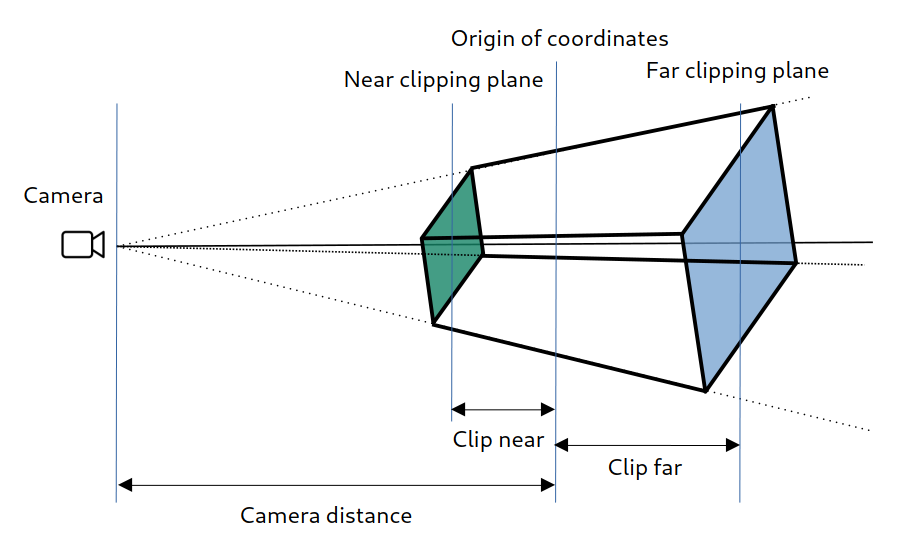

## Using BigVolumeViewer

By selecting a **B** checkbox in the Sources panel, you can view the 3D dataset in the BigVolumeViewer (BVV) window.  
  

BVV navigation controls (rotation, zoom, etc) are [the same as in BigDataViewer](./explore_a_project.html#browsing).  

It supports two rendering modes: Maximum Intensity projection and Volumetric (transclucent/alpha blending), see an example below.  
You can toggle between them using keyboard shortcut **`O`** (letter, not a number).  

You can synchronize the dataset view (and timepoint) with the BigDataViewer window view using shortcut **`D`**.  

Compared with 3DViewer volume rendering using a fixed resolution, BVV works directly with the raw data. It loads corresponding multi-resolution data levels depending on the current view.  

For the 3D volume rendering substantially more data is required to be loaded and processed, therefore for a smoother experience in displaying remote dataset it is recommended to use high-speed network connections.   
As with all 3D applications, a better GPU card with large amount of GPU memory is recommended. You can adjust the amount of dedicated GPU memory and tweak quality/performance using BVV setting command explained below. 

### Adjusting color(LUT), brightness and opacity

As with BigDataViewer, you can configure the appearance of each source in BVV using shortcut **`S`** (also in the Cards Panel, activated by a shortcut **`P`**).    
The square on the left shows a color that is used to display the volume.  
You can change it using left click. Or you can apply Fiji installed LUT using right-click.  

   

The top slider maps minimum and maximum shade of selected source color (or min and max of LUT) to the selected data range (like a standard Fiji's "brightness" dialog).  
Upon loading a source to BVV, its contrast and range will be taken from the current BDV source settings.  
There are additional source display setting, which you can expand by clicking on "three triangles" bar:  

  

The second slider from the top (marked as **γ**) adjusts non-linear color/LUT mapping by introducing gamma correction (a power-law). Overall color/LUT adjustments can be illustrated using an example below.  

  

### Opacity

Here we have a box volume, where intensities are increasing from 0 to 255, left-to-right slices. Intensity values are colored using ImageJ's periodic "3-3-2" LUT shown in the color bar. Changing min max range values of the top slider maps the range of LUT application with respect to the data (voxel values) range. Changing gamma slider introduces non-linear color mapping.  

Two bottom sliders adjust (or map) voxels' opacity, also called [alpha value](https://en.wikipedia.org/wiki/Alpha_compositing). It is especially important for the "Volumetric" rendering mode.  
The range slider marked with **α** (alpha) maps opacity range (0 = fully transparent, 1 = fully opaque) to the data intensity range. The very bottom slider, again, introduces independent non-linear gamma modulation of this mapping, marked "**γ α**". 

Now, let's return to the animation shown above. It was made using "volumetric" render. As you may see, the alpha slider range was set from 0 to 1, meaning that all voxels with intensity above or equal to 1 have opacity of 1 (completely opaque).  

The example shown below shows what will happen with a source view, if we independently change opacity (alpha value) mapping. 

  

Notice, that the colors in this example remain the same, only voxels' opacity is modified.  

The last element in source appearance control is the checkbox on the left from the **α** slider. It is used to synchronize top pair of sliders (color/LUT and **γ**) with the bottom pair (**α** and **γ α**), but not the other way around. It also synchronizes slider ranges. You can see its effect in the final part of the animation.   

In "real life examples", upon opening a data/volume, usually it is convenient to first keep this checkbox selected, to see the loaded volume and approximate data range. And later fine-tune the alpha range independently (checkbox unselected) for a better visualization result.  

### BigVolumeViewer settings

To change global BVV settings, right click on the BigDataViewer window and select "Configure BigVolumeViewer Rendering".  
Short parameters description (and [a bit longer](https://forum.image.sc/t/bigvolumeviewer-tech-demo/12104), if interested) :  

- **Render width and height** - the true quality of 3D rendering performed by GPU and stretched to the current window size. Increasing them makes better picture at the expense of higher computational load;
- **Dither window size** and **number of dither samples**. Interpolating nearby pixels (withing the window) instead of sampling the volume. Increasing these values will speed up rendering at the expense of quality;
- **GPU cache tile size** size of the 3D blocks (in pixels) that are loaded to GPU;
- **GPU cache size (in MB)** limits the storage of the data in GPU memory. Increasing this parameter speeds up data display (should be less than your available GPU memory).
- **Camera distance**, **Clip distance far/near** parameters define [viewing frustum](https://en.wikipedia.org/wiki/Viewing_frustum) of the perspective virtual camera. See a picture below to get an idea. "Camera distance" should be always larger than "clip distance near". If you want to get "BDV slice" view, you can set "clip distance near" to zero.   

