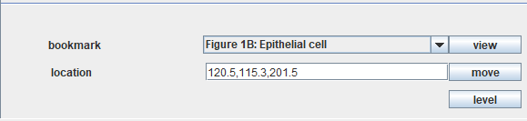
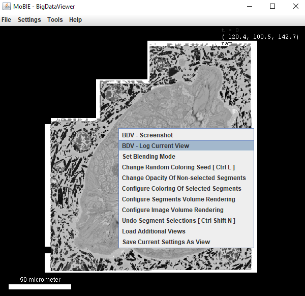

# Bookmarks and locations

 

## Locations

The viewer (BigDataViewer) places all images within the same physical coordinate system.
The current coordinates of your mouse are displayed in the top right corner of the window.

### Saving a location

To save your current location, you can right click in the viewer and select 
**log current location**

 

This will print a series of values to the **Log window** like so:
```
Position:
(105.89281976297173,89.52964460425457,142.70000000000002)
View:
2.796828718166384, 0.0, 0.0, -124.16407936069606, 0.0, 2.796828718166384, 0.0, -74.39908115640918, 0.0, 0.0, 2.796828718166384, -399.107458082343
Normalised view:
n0.00448209730475382,n0.0,n0.0,n-0.4746219220523975,n0.0,n0.00448209730475382,n0.0,n-0.40128057877629675,n0.0,n0.0,n0.00448209730475382,n-0.6395952853883702
```

- **Position** Location of where you clicked (x, y, z) in physical coordinates e.g. for the Platybrowser dataset, this is in micrometer
- **View** Orientation of your view - the 12 comma separated values here, are the affine transformation of this current view
- **Normalised View** Orientation of your view, normalised to window size.

### Moving to a location

To move to a position, you simply copy these saved numbers (either the position, view
or normalised view) into the **location** field and click **move**.

**Position** Using the (x, y, z) position will move your viewer to that location, but not change its current orientation
**View**  Using the 12 view values, will move your viewer to that location, and change the orientation to match. **Note:**
This is dependent on the size of your viewer window i.e. if your window is not the same size as when you saved the location, the result will be different.
**Normalised View** Using the 12 normalised view values, will move your viewer to that location, and change the orientation to match. It is normalised to the
size of your viewer window, and so should give very similar results independent of your current window size.

In general, we recommend using Positions (if you don't care about orientation), or Normalised Views (if you do).

## Bookmarks

Bookmarks are a way to save the current setup of your viewer, so anyone can browse to it
quickly and easily. Selecting a bookmark will take you to the exact location and orientation
saved, with the same images added to the viewer, and the same tables and colour scheme.

To access a bookmark, simply select it's name from the dropdown menu and select 'view'.
To create your own bookmarks - see tutorial X...

