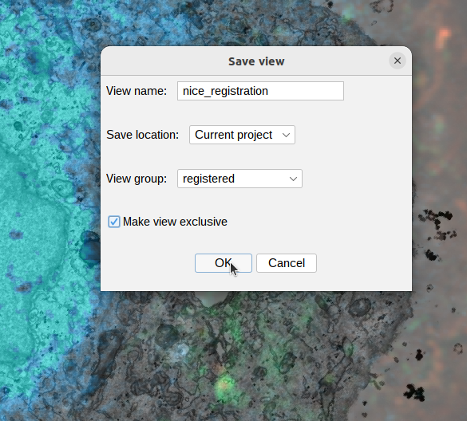
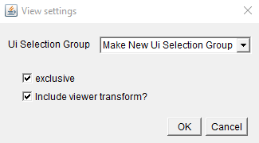
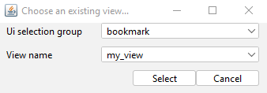

## Creating your own views

You can also add views from your own file system within MoBIE.

### Making a compatible view

Views save the current state of your MoBIE session, so you can easily return to
it later e.g. the location, orientation, open images, colouring schemes etc are
saved.

To make a view, right click in the MoBIE viewer and select
**Save Current Settings As View**. Then select a 'Save method' of 'Save as new view', and select save to **File_system**.

A dialog will appear with the following options:
- **view name** - The name of your view.
- **Ui Selection Group** -  The name of the MoBIE dropdown menu your view will
appear in. You can either select an existing one, or choose to 'Make New Ui
Selection Group'
- **exclusive** - When checked, this will make your view exclusive i.e. When
you 'view' it in MoBIE it will remove all other images before displaying it.
- **Include viewer transform?** - When checked, this will include the viewer
transform i.e. it will save the location and orientation of the current view.

Once filled in, a filebrowser will open, allowing you to choose where to save
your view. Views are stored in **.json** files. If you already have a view .json file, you can select it now to add your new view. If not, simply provide a name for your .json, and a new one will be created.

### Displaying your view in MoBIE

The view will be added automatically to the correct dropdown menu in MoBIE (note it may be at the bottom of this dropdown list - so scroll down!). Click the 'view' button to see it.

If you close and re-open MoBIE, you will need to right click in the MoBIE viewer and select **Load Additional Views**, then Load from **File_system**. You can then select your
.json file. Your new views will appear again in the relevant MoBIE dropdown menus.

### Modifying a view

If you wish to modify a view you have already saved, you can do this in a similar
way. Right click in the MoBIE viewer and select **Save Current Settings As View**.
Now select a 'Save method' of 'Overwrite existing view', and select save to **File_system**.

The dialog that follows allows you to choose the ui selection group, and other
parameters.

After this, a filebrowser will open where you can select a previously saved view
.json file, and then a particular view to overwrite. Clicking 'Select' when
the correct ui selection group and view name are shown will overwrite this view
with your current MoBIE settings.

