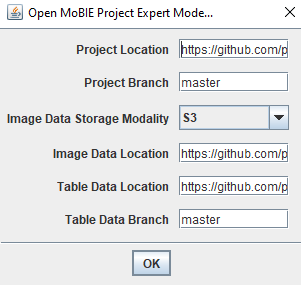

## Expert Mode

**Expert Mode** is another way to open MoBIE that gives much greater flexibility. It allows you to
choose where different aspects of your project (e.g. images and tables) are loaded from, allowing you
to have a mix of local and remote access, or remote access from multiple locations.

You can control three aspects:
- **Project Location** The location of all your project metadata (e.g. information about your datasets and images, views...)
- **Image Data Location** The location of your images.
- **Table Data Location** The location of your tabular data.

### Common use cases

**I'm using an existing project (remote), but want to modify the tables**

- Project Location: project github repository
- Image Data Location: project github repository
- Table Data Location: your own fork of that repository, or a local clone of it (where you've added or modified tables)

**I'm using an existing project (remote), but want to modify tables, and views**

- Project Location: your own fork of that repository, or a local clone of it (where you've changed views and tables)
- Image Data Location: project github repository
- Table Data Location: your own fork of that repository, or a local clone of it (where you've changed views and tables)

**I'm working with a local project on my file system, but want separate control of all metadata / tables**
- Project Location: project github repository
- Image Data Location: local project location
- Table Data Location: project github repository

... and any other combination of local and remote locations!

### Opening expert mode

To open expert mode, type **mobie** in the Fiji search bar, and select
**Open MoBIE Project Expert Mode...**

This will bring up a dialog, as below:

 

 - **Project Location** - github repository, s3 location or local file path
 - **Project Branch** - which git branch to load data from
 - **Image Data Storage Modality** - Which image format to use. Those that end with S3 are for remote access, the rest local.
 - **Image Data Location** - github repository, s3 location, or local file path
 - **Table Data Location** - github repository, s3 location or local file path
 - **Table Data Branch** - which git branch to load data from

### Open MoBIE Project Branch

If you only want to open a certain github branch of a project (without separate control over metadata, images an tables), you can use the **Open MoBIE Project Branch** command:

This will open a simplified dialog where you can select the github project location and branch.

