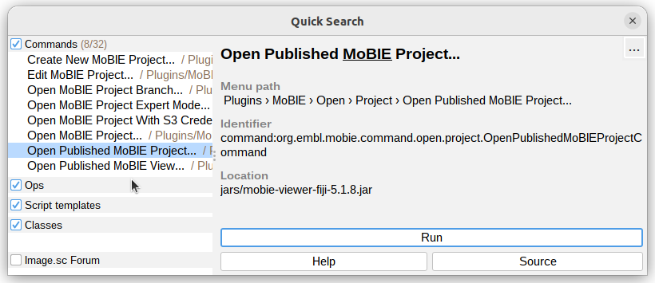
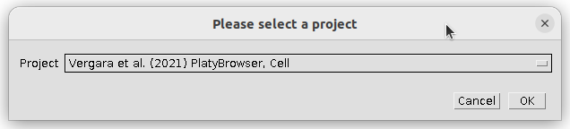
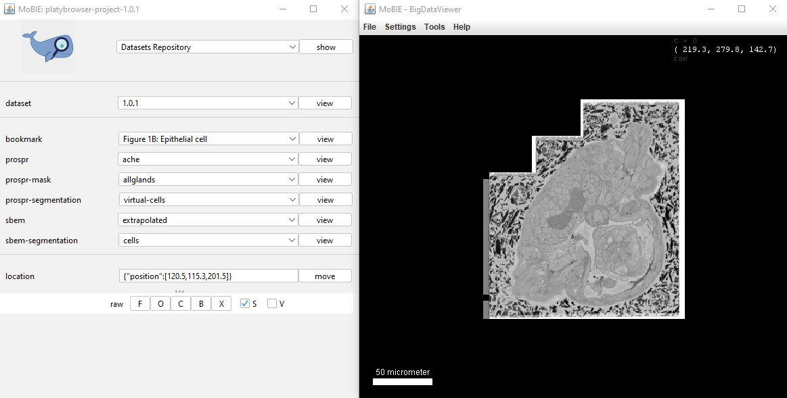
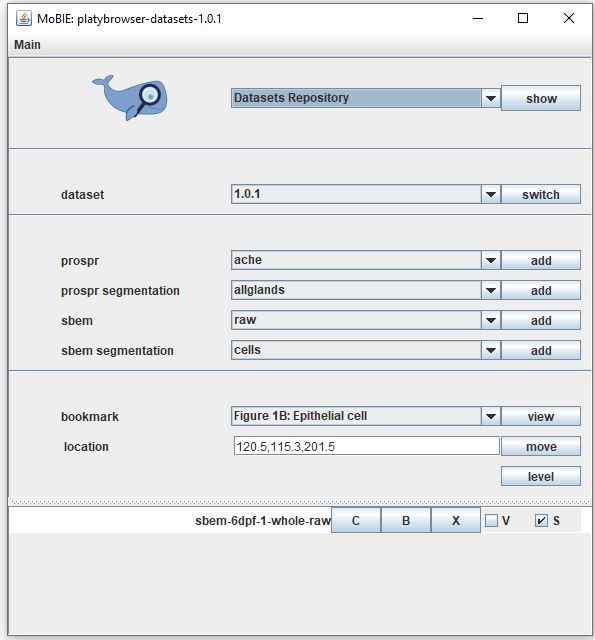
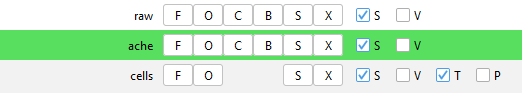
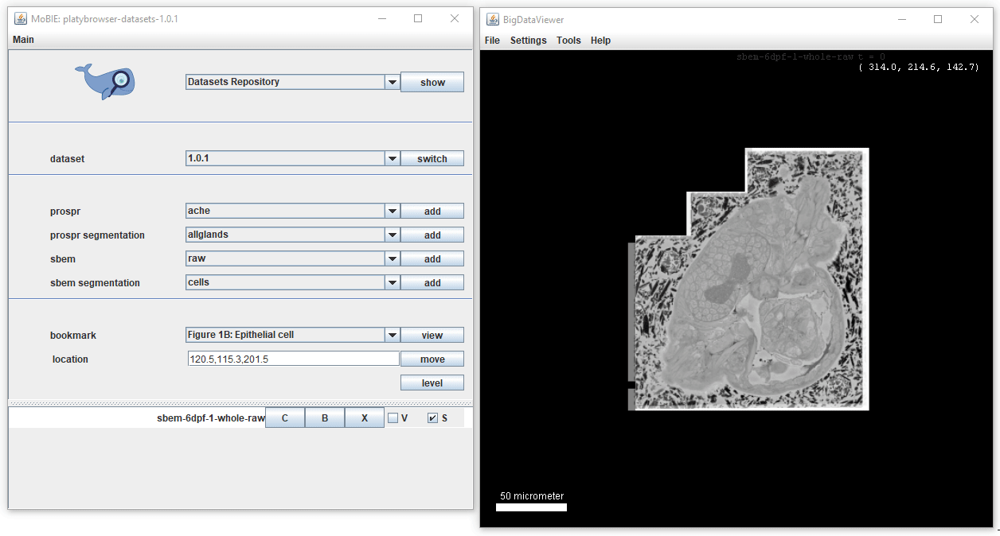

## Explore a project

MoBIE is focused around the idea of **projects** - a project contains all the information
needed to display your data e.g. which images and tables to display, where they are stored etc...

### How to explore an existing project?

Once the MoBIE plugin has been installed (see instructions [here](https://github.com/mobie/mobie-viewer-fiji#install),
you can open a project:

1. In the Fiji search bar, type: "mobie"     
...select 'Open MoBIE Project..' and click [ Run ]
2. Enter the location of the project (a github repository).  
We will use the published 'Platybrowser' project as an example (location: https://github.com/mobie/platybrowser-datasets)
  
3. The MoBIE viewer is ready to be used: 

The left window contains all the controls for MoBIE, and the right is a [BigDataViewer](https://imagej.net/BigDataViewer)
window allowing you to browse images.

Note: It is also possible to open projects from your local file system (see advanced tutorial)

### Browsing in the viewer

All the controls for BigDataViewer can be found under Help > Show Help in the menu at the top of the 
viewer.

  
The most important controls are:   

* **[Left click + drag]** Rotate view
* **[Middle click + drag, or right click + drag]** Pan in xy
* **[Scroll]** Move along z axis
* **[Up / Down arrow keys]** Zoom in and out

### MoBIE Controls

Each MoBIE Project is made up of a number of **Datasets**. Each dataset is a combination of images that can be
displayed together in the same physical coordinate system.
e.g. datasets could be images from different samples, timepoints, or entirely separate experiments!

In our example project, the Datasets are used to represent different versions of the data e.g.
after rounds of segmentation proofreading.

  

- **[ info ] Get information / help on a certain topic.** Select an item from the drop-down and click the button.
- **[ switch ] Switch dataset.** Select a datset from the drop-down and click the button.
- **[ add ] Add an image source to the view.** Select an image source from the drop-downs and click the button. If the image source is a segmentation, also a corresponding objects table will appear. 
Note: the categories available here are specific to the project! e.g. in this example project, two categories 'propsr' (gene expression data) and 'sbem' (electron microscopy data) are available.
- **[ view ] View a bookmark.** Select a bookmark from the drop-down and click the button. The corresponding bookmarked view will appear. See bookmarks tutorial for more...
- **[ move ] Move to a particular position or view.** See tutorial for more...

### Sources Panel
As you add more images to the viewer, they will appear in the **sources panel**, like below:
  

To control the image sources appearance, there are several buttons...

- **[ C ]**  Change the color
- **[ B ]**  Change the brightness settings
- **[ X ]**  Remove from viewer and sources panel

...and checkboxes:

- **[ X ] V**  Check to show source in **v**olume viewer
- **[ X ] S**  Check to show source in **s**licing viewer (i.e., BigDataViewer) 

 

