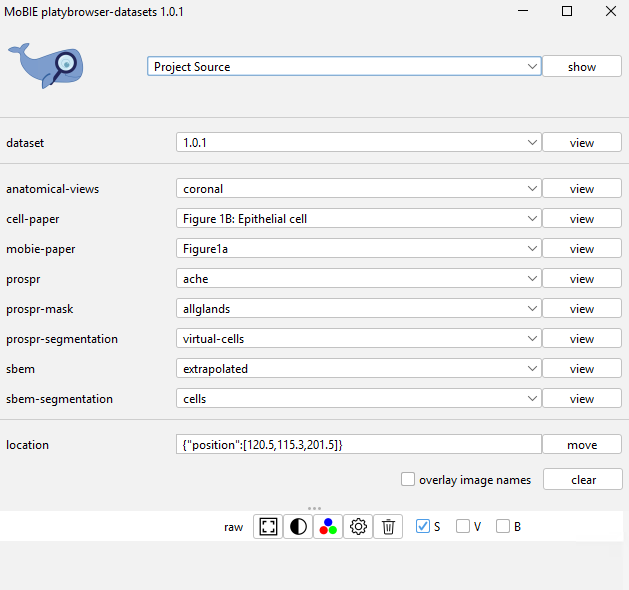
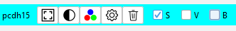
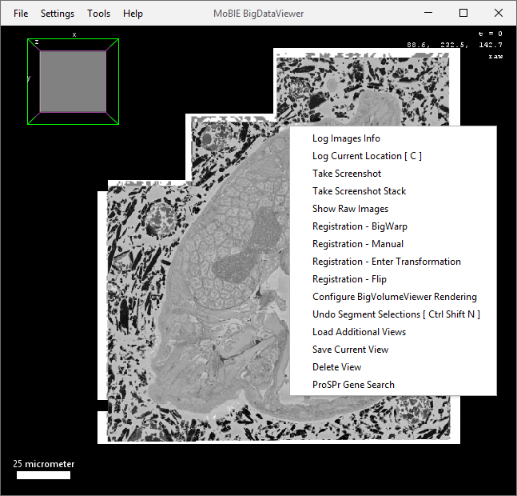

##  Basic image browsing

All the controls for BigDataViewer can be found under Help > Show Help in the menu at the top of the viewer.

The most important controls are:   

* **[Left click + drag]** Rotate view
* **[Middle click + drag, or right click + drag]** Pan in xy
* **[Scroll]** Move along z axis
* **[Up / Down arrow keys]** Zoom in and out
* Hold `Shift` to rotate and browse 10x faster. Hold `Ctrl` to rotate and browse 10x slower.

### MoBIE Controls

Each MoBIE Project is made up of a number of **Datasets**. Each dataset is a combination of images that can be
displayed together in the same physical coordinate system.
e.g. datasets could be images from different samples, timepoints, or entirely separate experiments!

In our example project, the Datasets are used to represent different versions of the data e.g.
after rounds of segmentation proofreading.

  

**Descriptions of buttons:**  

- **[ show ] Get information / help on a certain topic.** Select an item from the drop-down and click the button.
- **[ view ] on the 'dataset' row - switch dataset.** Select a dataset from the drop-down and click the button.
- **[ view ] on any other row - display a view** Select a view from the drop-down menus and click the button. Views can contain a number of images and segmentations, as well as tables, plots and 3D views.
**Note:** the drop-down groups available here are specific to the project! e.g. in this example project, groups like 'propsr' (gene expression data) and 'sbem' (electron microscopy data) are available.
- **[ move ] Move to a particular position or view.** See [here](./views_and_locations.md) for more information.
- **[clear] Remove all sources.** This button removes all displayed sources.
- **overlay names checkbox** When enabled, shows names of images in the image viewer.

### Sources Panel
As you add more images to the viewer, they will appear in the **sources panel**, like below:
  

To control the image sources appearance, there are several buttons...

-  Focus the viewer on the source
  Focus the viewer on the source
-  Change the brightness and opacity settings
-  Change the color
-  Open the display settings (the options available here will depend on the
corresponding display e.g. different options for images vs segmentations).
-   Remove from viewer and sources panel

...and checkboxes:

- [ ] **S**  Check to show source in **s**licing viewer (i.e., BigDataViewer)
- [ ] **V**  Check to show source in **v**olume viewer (i.e. in 3D)
- [ ] **B**  Check to show source in **B**igVolumeViewer (i.e. also in 3D)
- [ ] **T**  Check to show **t**able
- [ ] **P**  Check to show **p**lot (i.e. a scatter plot)

Note that the available buttons and checkboxes depends on what was present in the selected view e.g. the **T** checkbox will only appear if a table is available.

### Other Controls

There are some extra MoBIE options available by right clicking in the BigDataViewer window. For example, making high quality screenshots, or logging the current position.

See [here](./more_features.md) for information about taking high quality screenshots and other features.
