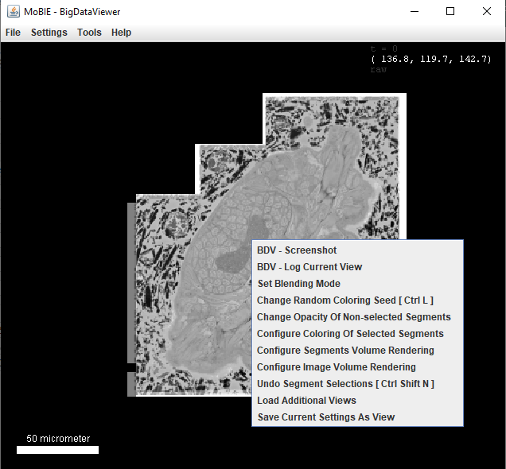
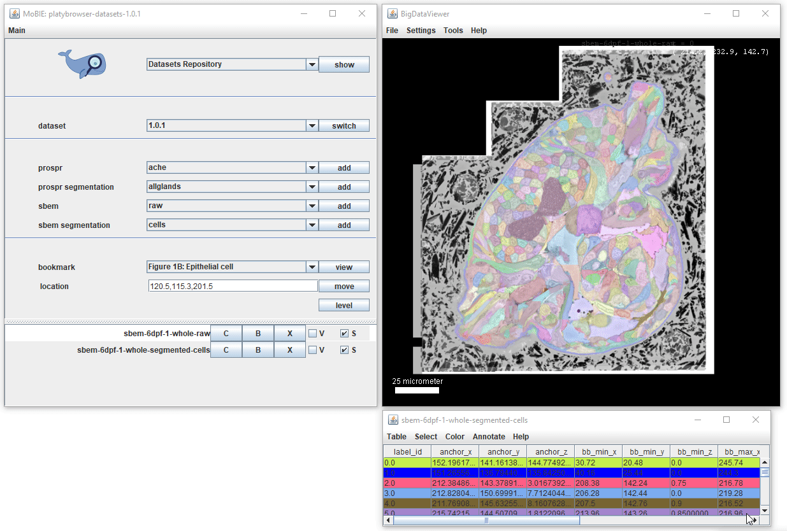

## Exploring segmentations

Adding a segmentation to the viewer, will display it as a coloured overlay on your image. If available,
a corresponding table will also appear, where each row corresponds to one segmented object.

Both the table and segmentation overlay can be explored interactively:

### Interacting with the segmentation in the viewer

All keyboard shortcuts are available by selecting **Segmentations Browsing**
from the top dropdown menu of the MoBIE controls, and clicking the 'show' button.

To summarise:
- **[Ctrl + left click]** Select a segmented object. This will also cause the corresponding row of the
table to highlight. If you have **V** ticked in the sources panel, it will also display it in the 3D viewer.
- **[Ctrl + L]** Randomly shuffle the colours of the segmented objects.
- **[Ctrl + shift + N]** Undo any segment selections.

More options are available if you right click in the viewer:

- **Change Random Coloring Seed** Same as Ctrl + L above.
- **Change Opacity of Non-selected Segments** Changes opacity of non-selected segments
- **Configure Coloring Of Selected Segments** Can change between showing Segments
in the 'default colour' (i.e. whatever their current colour is), or a specified 'selected color'.
- **Configure Segments Volume Rendering** Change resolution with which segments are
shown in the 3D viewer.
- **Undo Segment Selections** Same as Ctrl + Shift + N above.

### Interacting with segmentation table

Clicking on a row in the table, will move you to the location of that object in the viewer.
Ctrl + clicking on a row, will also select that object.  
The first column 'label_id' states the id of each segmented object from the image.

### Adding more tables

Usually, the default table that appears with a segmentation only contains very minimal information e.g. the
position of objects and their bounding boxes.

You can add more tables from the project, by selecting Table > Load Columns... and then
Load from **Project**. This will make a dropdown menu appear with all available tables.
e.g. in the example Platybrowser project there are tables for morphology statistics, gene expression and more...

New columns will be added to the right of table, and can be viewed by scrolling
horizontally on the bar at the bottom of the table.

You can also add tables from your File System (see tutorial [here](./viewing_your_own_tables.md))

### Selecting based on table values

You can select segments based on values in the table by using the options under
'Select' in the menu at the top of the table.

- **Select all** Select all segments.
- **Select equal to** Select segments with a value equal to the input for a
chosen column.
- **Select less than** Select segments with a value less than the input for a
chosen column.
- **Select greater than** Select segments with a value greater than the input
for a chosen column.

### Colour by column...

Selecting Color > Color By Column... from the table menu will allow you to colour your segmented objects
based on the values in a certain column.
e.g. you could colour based on the value of a calculated statistic, or based on membership to different clusters.

The dialog allows you to select the Column you want to colour based on, and a colouring mode. The final
checkbox **Paint Zero Transparent** controls whether 0 values are transparent in the viewer or not.

Colouring Modes:

- **BlueWhiteRed** For numerical data - colour objects from blue (low value) to red (high value)
- **Viridis** For numerical data - colour objects based on viridis colour scale.
- **Glasbey** For categorical data - colour objects from Glasbey colour palette.
- **A-R-G-B Column** Used for custom colour schemes - needs a selected column where each entry is of the format A-R-G-B, specifying the colour for that row

For the palettes designed for numerical data, a popup will appear allowing you to change the minimum and maximum
values for the colour palette. This is useful if you want to focus on / see differences in a smaller range of values.

### Saving tables

Tables can be saved by using Table > Save Table as... in the menu at the top of the table.

Specific columns can be saved by using Table > Save Columns as...

They will be saved as tab separated files.
