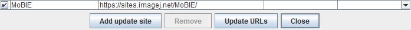
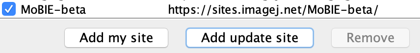

## Installation

### MoBIE Update Site

Install Fiji, and enable the MoBIE update site ([how to install an update site](https://imagej.net/Following_an_update_site#Introduction)).  
In detail:

1. Please [install Fiji](https://fiji.sc) on your computer.\  
2. Open Fiji and go to [ Help > Update... ] in the menu.\
3. Click [ Manage Update Sites ]\
4. Click the checkbox next to `MoBIE`\ 

5. Click [ Close ]\
6. Click [ Apply changes ]\  
7. Restart Fiji

### MoBIE-beta Update site

If you want to try out the latest, experimental version of MoBIE - you can
enable the MoBIE-beta update site. Note that this will be rapidly changing /
unstable!

The MoBIE-beta update site ships the very latest version of MoBIE, 
which may **not be compatible** with the current one from the official 
MoBIE update site. Therefore, if you want to try it out, we recommend 
doing this in a dedicated Fiji, e.g. stored in a folder on your Desktop with 
the name `Fiji-MoBIE-beta.app`.

To try MoBIE-beta you need to:

1. Open a Fiji\
2. [ Help > Update... ]\ 
3. [ Manage Update Sites ]\  
4. Manually add the update site, by clicking [Add update site] and filling in the boxes
to match below:\

5. [ Close ]\
6. [ Apply changes ]\  
7. Restart Fiji 