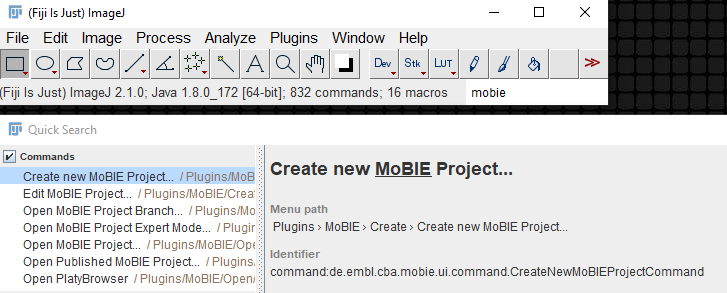
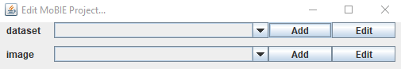
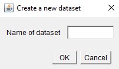
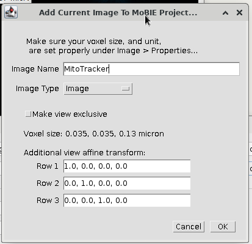
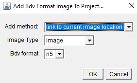
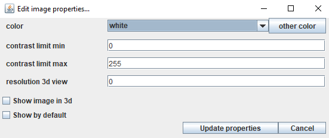

## MoBIE Project Creator

For making projects on your local file system, you can use the MoBIE Project Creator within Fiji.  
**Note**: if your images are particularly large, or you want more control over your project, you can
create your project with this [python library](https://github.com/mobie/mobie-utils-python). See
[here](https://github.com/mobie/mobie) for details of project structure.

Type MoBIE in the search bar, and select the **Create new MoBIE Project** command.  

 

Navigate to a folder, and provide a project name.
This will create a new project, and open the **Edit MoBIE Project** dialog.  

 

Note: you can open this at any time by typing MoBIE in the search bar and selecting **Edit MoBIE Project**.

### Creating datasets

A dataset is a combination of images that can be displayed in the same physical coordinate system e.g.
you might make this images from different samples, or timepoints, or separate experiments.

Click **Add** on the dataset row, and provide a name for your dataset. Clicking **OK** will create the dataset,
and add it to the dataset dropdown.  

 

The first dataset you create will automatically become the default i.e. the one you see when you first
open that MoBIE Project. To make another dataset the default, select it in the dataset dropdown, then 
click **Edit**, and tick the checkbox next to **Make default dataset**.  

 

This Edit menu also allows you to rename datasets.

### Adding images

To add an image to a dataset, make sure the chosen dataset is selected in the dataset dropdown.
Then follow the directions below for either **open current image** (to add images open in imageJ) or 
**bdv format image** (if your image is already in bdv h5 or n5 format).

**Note**: if your images are particularly large, it will be more efficient to convert your images outside of
imageJ. e.g. using this [python library](https://github.com/mobie/mobie-utils-python)

#### Current open image

- Open the image you want to add, as you normally would, in imageJ. Make sure the pixel size and unit
are set under Image > Properties...
- Click **Add** on the image row and select **current open image**
- Give your image a name, and select the image type and format. (see **Image type** and **bdv format** below for
more details)

 

- The image will be converted to your chosen image format and saved to the project with the appropriate metadata.
It will appear in the image dropdown.

#### Add bdv format image

- Click **Add** on the image row and select **bdv format image**
- Select the xml file of the chosen image
- Select the Add method, image type and bdv format. (see **Image type** and **bdv format** below for
more details)  
 

- The image will be added to the project, and appear in the image dropdown. If the image was a segmentation,
it will also calculate a corresponding table. This can take some time, especially for large images.

For the add method:
- **link to current image location**, this will leave the image where it is, and just link to it inside
moBIE's metadata.
- **copy image**, copies the image into the project
- **move image**, moves the image into the project. Note: Be careful with this, it will delete your image from
its original location.

#### Image type
- **image** is a standard image 
- **segmentation** is a label image with segmented objects
- **mask** is a binary image

#### Bdv format
- **h5** is bdv hdf5
- **n5** is bdv n5

### Editing image metadata
To change how the images are displayed by default, click **Edit** in the image row.
Different options will be shown dependent on the type of the image.  
 

Note: the first image you add to a dataset, is automatically set to **show by default**. This can be changed
by unchecking this box in the Edit window. At least one image must be shown by default.

For details of what these settings control, see the **settings** section of this [tutorial](./bookmarks.md)

### Open your local project

To open your new project, type MoBIE in the search bar and select the **Open MoBIE Project...** command.
Enter the file path to your project as the **Project Location**.
