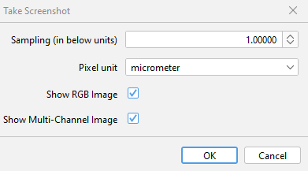
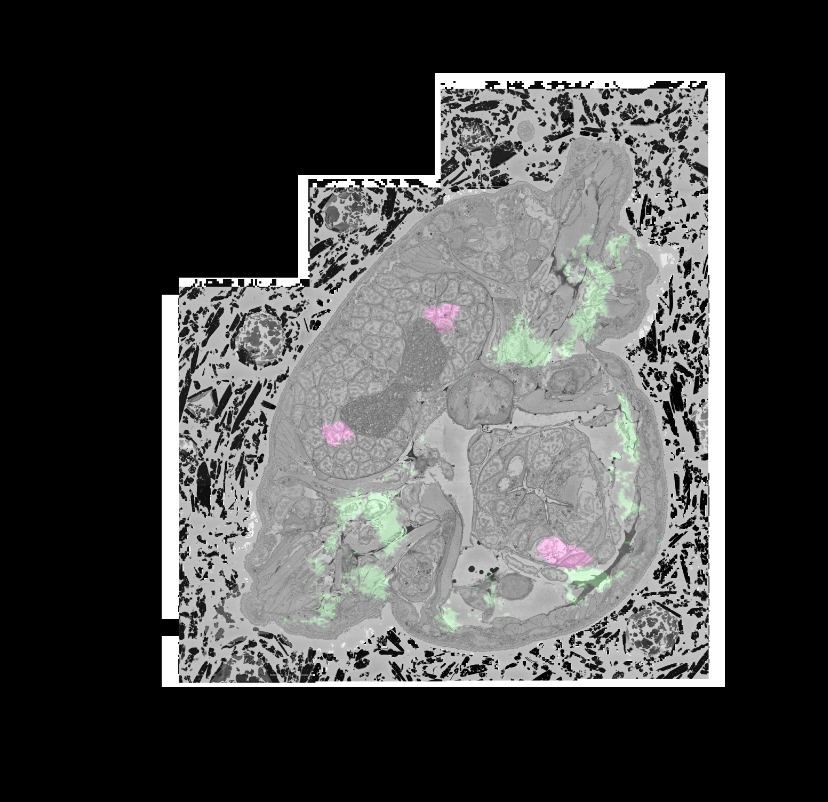
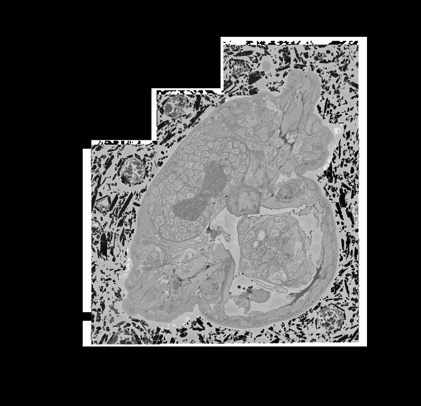
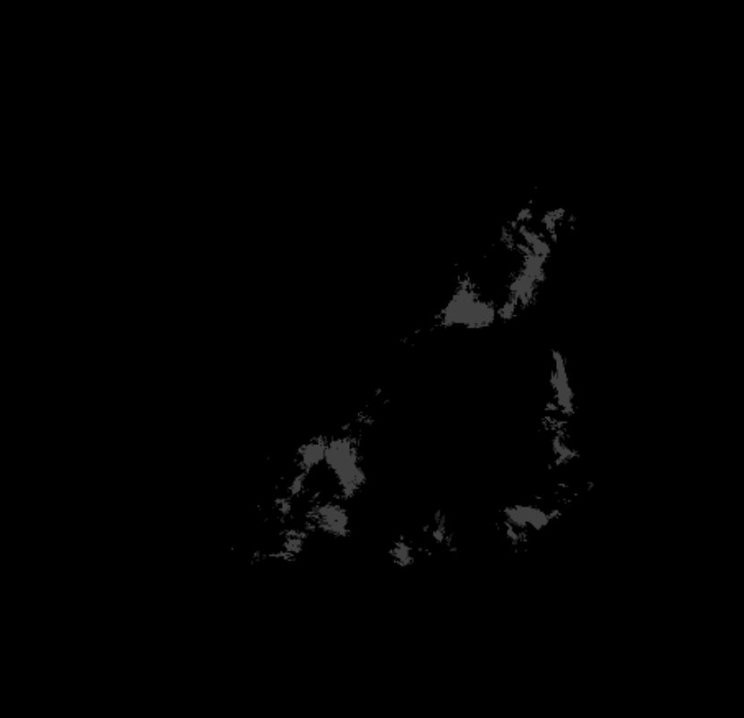
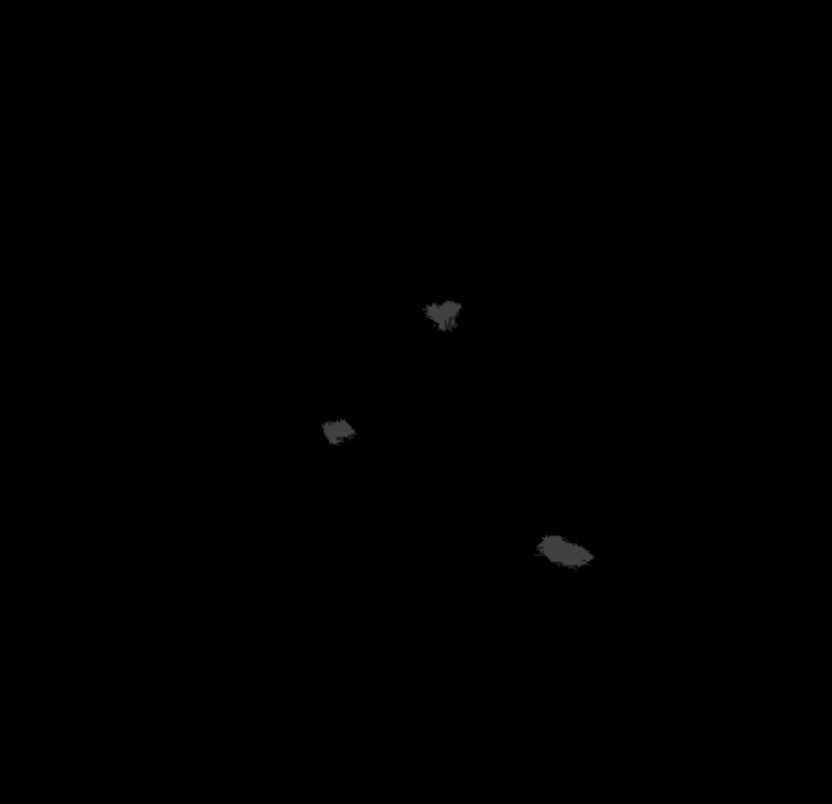
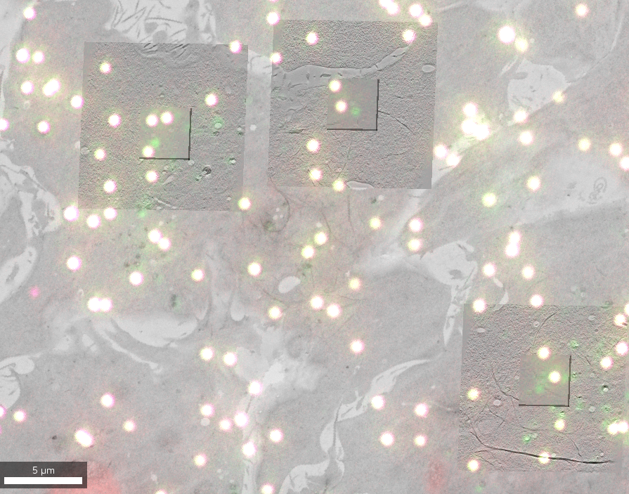
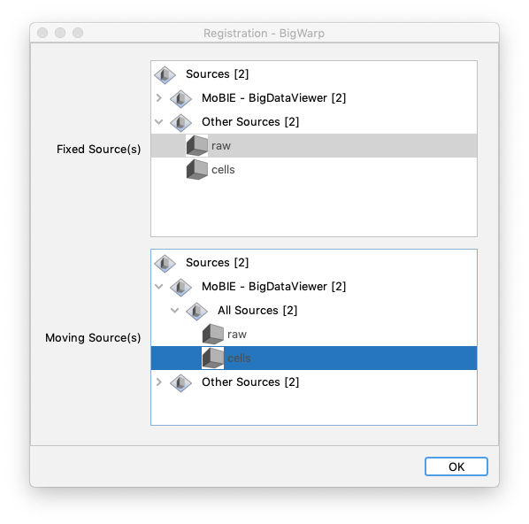

# More Features

MoBIE supports more features than the ones described in the previous tutorials. Here is a not exhaustive list of those features:

## Screenshots

To take a screenshot of the MoBIE viewer, right click inside it and select **Take Screenshot**.

This will open the following menu:

- **Sampling** - Sampling of screenshot (uses same units as viewer, see the viewer scalebar).
- **Show RGB Image** - create an RGB image of the viewer.
- **Show Multi-Channel Image** - create a multi-channel image, where each image shown in the viewer becomes
a separate channel.

The screenshots produced will be opened as normal ImageJ images that you can save / analyse however
you want.

As an example, take this setup from the Platyneris project:

Here the raw EM data is shown, as well as 2 images showing the expression pattern of
two genes (in green and pink).

Taking a screenshot with **Show RGB Image** checked gives:

and with **Show Multi-Channel Image** checked, gives a multi-channel image with the
following 3 channels:

 raw | ache | allcr1
---|---|---
  |   | 

## Show Raw images

You can also export the raw data shown in MoBIE at various resolution levels.
To do so, right click in the MoBIE viewer and select **Show Raw Image(s)**

This will open a window like below for each image shown:

Here you can select which resolution level to export. In this dropdown, the pixel dimensions
of every resolution level are shown. For example, in the above image the selected resolution level
is an image of 27499 x 25916 x 11416 pixels.

Make sure you select a resolution level that your computer can handle! For example,
if your working on a laptop without much memory then you should select a lower resolution level with
an image of smaller total size.

All exported images will be opened as normal ImageJ images that you can save / analyse however
you want.

## Register images/sources

As every [view](../specs/template_view.md) can contain sets of transformations that are applied before it is displayed, sources and images can be shown registered on top of each other.

The transformations can be generated using external tools and then provided as part of a view, or generated directly in MoBIE. This registration functionality is also demonstrated in [an example video](https://youtu.be/jKlM68lrhso).

### Manual registration
In order to manually transform sources (and register them to each other), right click inside the MoBIE viewer and select **Registration - Manual**.

The following window with instructions will appear:

The currently active source(s) selected in MoBIE's BDV window can now be moved with the standard [viewer controls](./explore_a_project.md#browsing) (translations, rotations, scaling). All unselected sources stay where they are. 
The transformation can be stored by pressing **[T]** or discarded **[Esc]**.

### BigWarp
In order to transform sources and register them to each other using [BigWarp](https://imagej.net/plugins/bigwarp), right click inside the MoBIE viewer and select **Registration - Manual**.

The following window will appear:

Here you select which source(s) will stay fixed and which sources move during the transformation. The exact procedure is explained in [BigWarp's tutorials](https://imagej.net/plugins/bigwarp).
