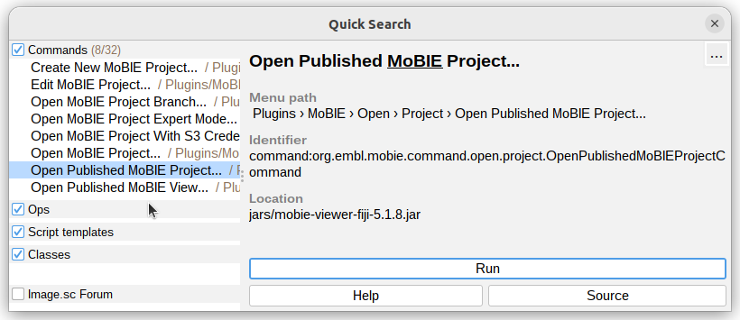
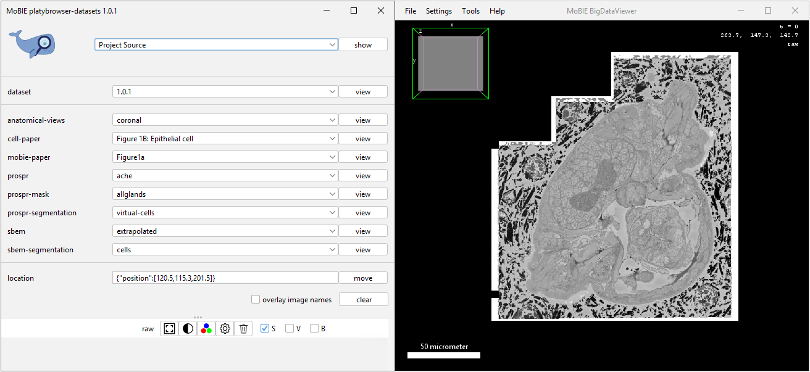

## Explore a MoBIE project

A MoBIE **project** contains all the information needed to display your data e.g. which images and tables to display, where they are stored etc...

### How to explore an existing MoBIE project?

Once the MoBIE plugin has been installed (see instructions [here](./installation.md)),
you can open a project:

1. In the Fiji search bar, type: "mobie"    
...select 'Open published MoBIE Project..' and click [ Run ]  

2. Enter the location of the project (a github repository).  
We will use the published 'Platybrowser' project as an example (location: https://github.com/mobie/platybrowser-project)
  

3. The MoBIE viewer is ready to be used: 

The left window contains all the controls for MoBIE, and the right is a [BigDataViewer](https://imagej.net/BigDataViewer)
window allowing you to browse images.

Note: It is also possible to open projects from your local file system.