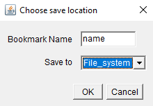

## Viewing your own bookmarks

You can also view bookmarks from your own file system within MoBIE.

### Making a compatible bookmark

Bookmarks save the current state of your MoBIE session, so you can easily return to it later e.g.
the location, orientation, open images, colouring schemes etc are saved. 

To make a bookmark, right click in the MoBIE viewer and select **Save Current Settings As Bookmark**.
Then, name your bookmark, and select save to **File_system**. 

 

A filebrowser will open. Bookmarks are stored in **.json** files. If you already have a bookmark .json file, 
you can select it now to add your new bookmark. If not, simply provide a name for your .json, and 
a new one will be created.

### Viewing your bookmark

To view your new bookmark, right click in the MoBIE viewer and select **Load Additional Bookmarks**,
then Load from **File_system**. You can then select your .json file.

Your new bookmarks will appear in the bookmark dropdown menu.

