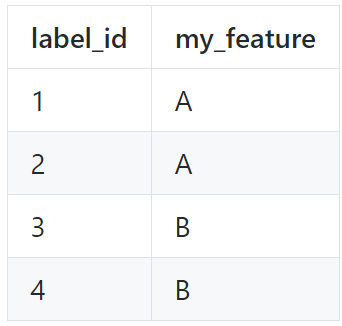

## Viewing your own tables

You can also view tables from your own file system within MoBIE.
e.g. this can allow you to view your own measurements alongside all the other data of an
existing project.

### Making a compatible table

Your table must contain a column **label_id** stating the ids of the relevant segmented objects.
This is the column that will be used to match, and merge your table to the default one for that
segmentation.

You do not have to list every label id e.g. if you are only interested in a subset of the segmented
objects, you can include those only. Any missing values when your table is merged will be filled
by None (for categorical data) or NaN (for numeric data).

e.g. the table below would be a valid table (but you could add as many additional columns
as you'd like):

Save your table as a .tsv file (both comma-separated and tab-separated are suitable).

### Viewing your table

To view your table select Table > Load Columns... from the menu at the top of
the table. Then, Load Columns from **File System** in the dropdown.

This will create a file browser, where you can select your .tsv file.

Your new columns should now be added to the right side of the table - scroll with the slider
at the bottom of the table to see them.

If you want more control over your tables / want to add many at once, you will have to use
**Expert Mode** - see tutorial [here](./expert_mode.md)
