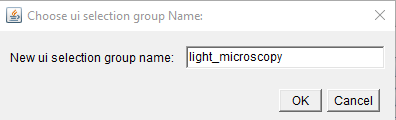
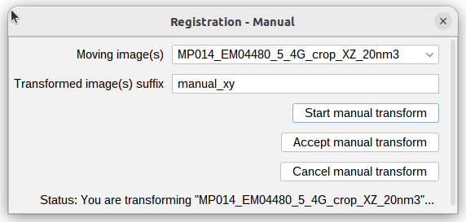
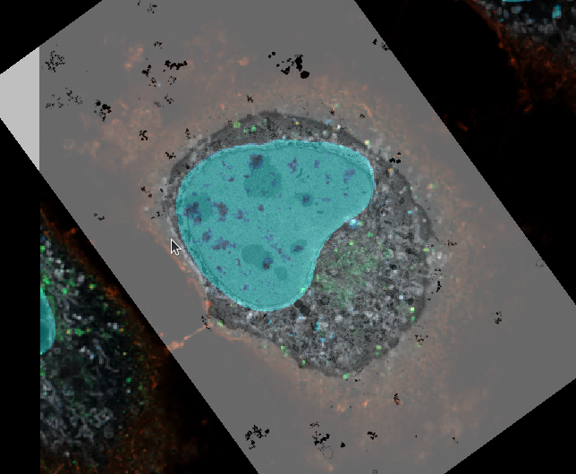
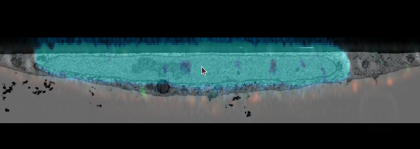

## Volume registration

This tutorial will show how to generate a project from multimodal volume images and register them.

### retrieve the raw data

 - To download the Electron microscopy (EM) dataset, head to [https://www.ebi.ac.uk/empiar/EMPIAR-11537/](https://www.ebi.ac.uk/empiar/EMPIAR-11537/), make sure to de-select all data except #4 "Downscaled (20nm) aligned FIB SEM stack resliced to match the Airyscan dataset" and click the individual download button (choose HTTP).

 - The Fluorescence microscopy (FM) dataset is stored at [https://www.ebi.ac.uk/biostudies/bioimages/studies/S-BSST1075](https://www.ebi.ac.uk/biostudies/bioimages/studies/S-BSST1075). You can download the raw data file [directly from here](https://www.ebi.ac.uk/biostudies/files/S-BSST1075/EM04480_05_4G_Hoechst_GFP-TGN46_agglutinin_mitotracker.czi).

### create the MoBIE project

- open the LM data in Fiji using the BioFormats Importer plugin. (`Plugins > Bio-Formats > Bio-Formats Importer`)
- you should get a Hyperstack image with 4 channels. (MitoTracker, Agglutinin, GFP-TGN46, and Hoechst)
- adjust the lookup table for each channel to fit the fluorophore. (`Image > Lookup Tables`)
- Currently, the MoBIE project creator only supports single channels, so we have to split the fluorescence stack into separate channels using `Image > Color > Split Channels`.
---

- create a new MoBIE project: type "mobie" in the search bar or choose `Plugins > MoBIE > Create > Create New MoBIE project...`

  name the project as you like and create it in a local directory.
- add a new dataset, name it as you like. Do not tick "2D".

- select the first channel image in Fiji
- add a new source `current displayed image`, call it appropriately (channels are sorted inverse), make sure the Image type is "Image" and do not tick `make view exclusive`.

- choose the `selection group name` as "fluorescence" or "FM"

- open the MoBIE project to see how the scaling and LUT are transferred 

---

- continue the same way with the other channels, adding them to the same dataset and selection group.
- open the other channel views using the MoBIE UI and explore the multi-channel volume
- right click into the multi-channel viewer and `Save current view`
- `Save as new view`, save to `projcect`
- Call the view something like "all channels" and make it part of the "FM" group
- close MoBIE

---

- open the EM data in Fiji
- add the volume to MoBIE under the selection group "EM" (make new selection group) to the same dataset. The format conversion can take a couple of minutes.
- open the MoBIE project and view your multichannel FM and EM together
- make all fluorescence channels but the Hoechst invisible by clicking on `S`
- change contrast and transparency settings for the relevant sources (`B`)

- right click the image "registration manual", select the EM image as we want to keep the multi-channels where they are.

- Click `Start manual transform` 
- use the right mouse button to drag the image around.
- Press the `z` key to make sure rotations are around the viewing axis and use the right and left arrow keys to rotate.
- You can also use the mouse wheel to translate in `z`, and the up and down arrows to scale (dangerous).
- If necessary adjust brightness or opacity of the images using MoBIE's main window (`B`).
- click `cancel manual Transform` to undo the translation and bring the image back to its original position.
- click `Accept manual Transform` to make it permanent and store the view into the project. This will only save the transformed EM source. Create a new selection group "registered".
- clear the viewer
- open the registered view an all FM channels. Check their registration by scrolling through the volume.

---

- push `CTRL + y` to view the volume from the side. Make sure te mouse pointer is in the center of the feature, as it determines the viewer's rotation axis.
- repeat the manual registration of the EM volume until your registration matches in all axes.

- You could also use the mitochondria or another channel for refining it.

Note that when clicking `Accept manual transform` the single transformed source will be saved as a new view. In case you like to transform more.

- To save a complete view with all sources (channels + EM), do `right click > save current view` and save your view as desired.
