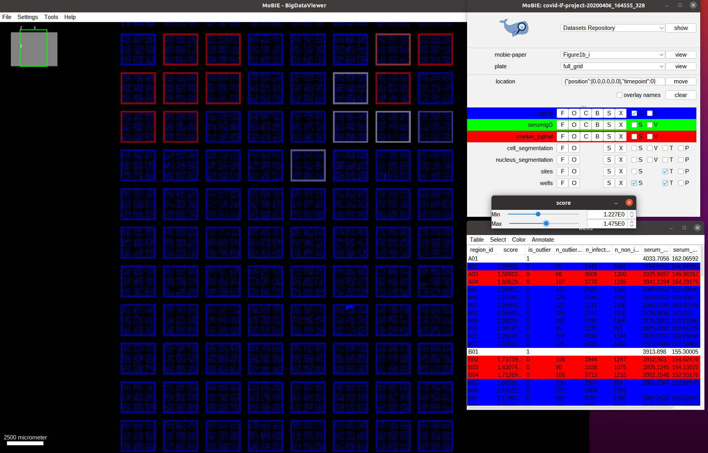
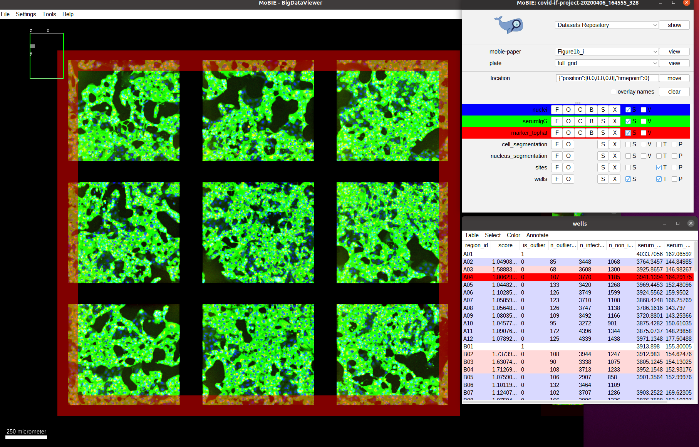
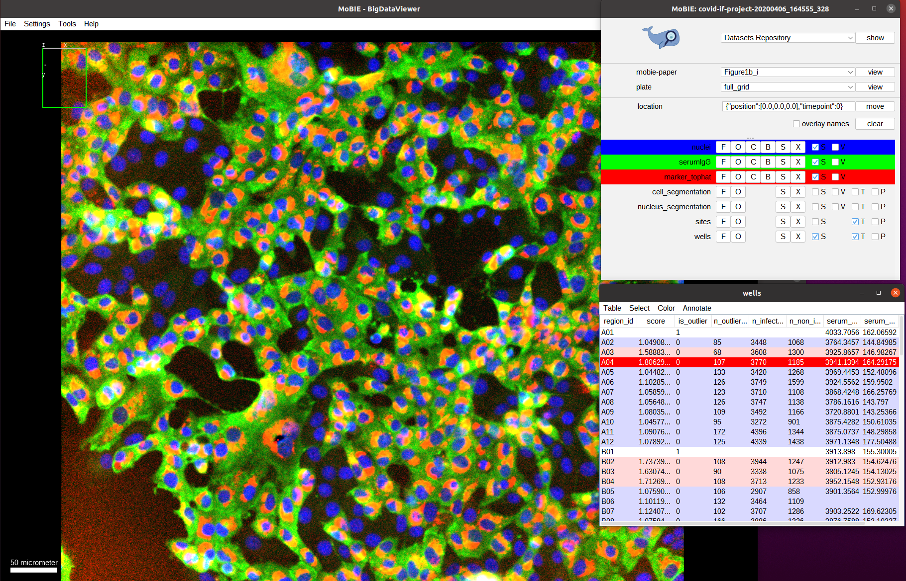
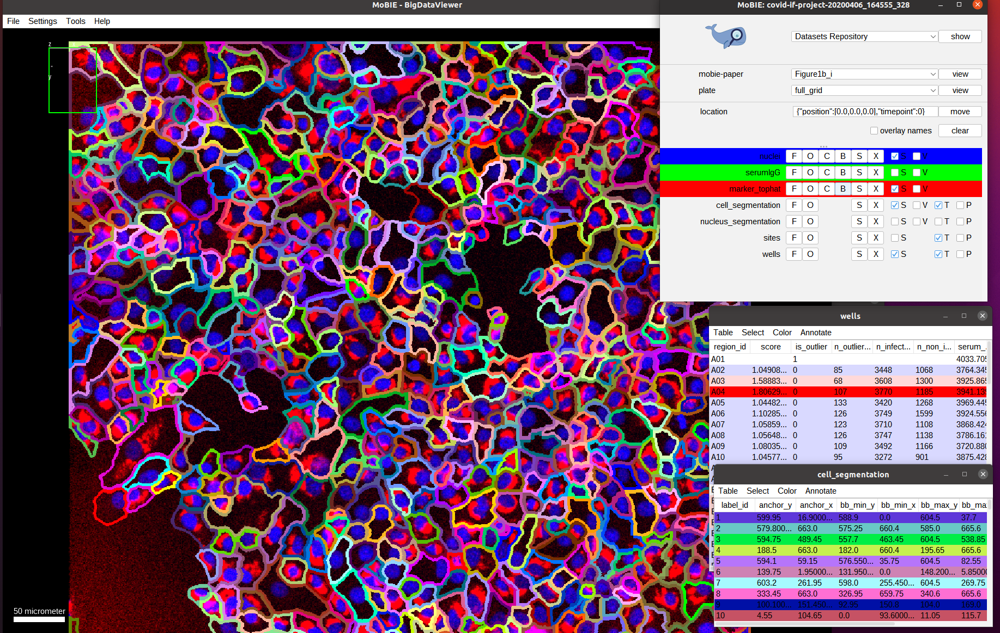
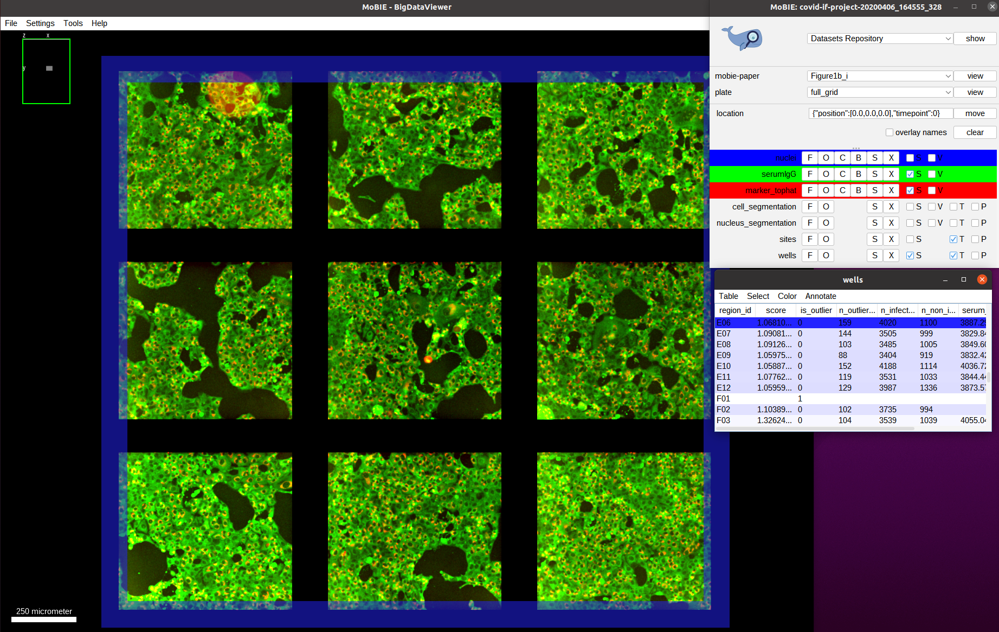

# High-throughput microscopy

In high-throughput (screening) microscopy light microscopy techniques a large number of images are taken, usually by imaging *wells* that are distributed on a *plate*.
This technique is often used to study samples under different conditions, each well potentially representing a different condition, for example for drug screening, diagnostics or knockout studies.
Here we showcase the [covid-if-project](https://github.com/mobie/covid-if-project) that visualizes data from an immunofluorescence assay to measure the SARS-CoV-2 antibody response in human serum.

## Data & project set-up

The data for this project comes from the publication [Microscopy-based assay for semi-quantitative detection of SARS-CoV-2 specific antibodies in human sera](https://doi.org/10.1002/bies.202000257), which provides several plates of immunofluorescence data.
We have imported one plate for demonstration purposes. Each position in the plate contains thre image channels, a nucleus channel, a serum channel and a virus marker channel, as well as derived nucleus and cell segmentations.
The assay derived from this data measures the SARS-CoV-2 antibody response via the intensity ratio between infected and non-infected cells.
These ratios and other relevant well,- image- and cell-level data are provided.

We converted the data from the original publication, which is stored in hdf5, to the MoBIE format using the [MoBIE python library](https://github.com/mobie/mobie-utils-python/tree/master/mobie/htm); the scripts that call the library are [here](https://github.com/mobie/covid-if-project/blob/main/add_plate.py).
The project metadata is stored [github](https://github.com/mobie/covid-if-project) and the image data stored on the EMBL S3 server.

## Exploring the project

Open the project from [https://github.com/mobie/covid-if-project](https://github.com/mobie/covid-if-project). See ["Getting Started"]("../tutorials/explore_a_prject.md") for how to open a project in the MoBIE Fiji plugin.
The project will open to the `default` view, which shows just two of the 96 wells of the plate. (This is done in order to open the project fast.)
We switch to the view `full_grid` to see the full plate:
    

This overview shows the full plate and has the nucleus channel (DAPI) activated. We also see each well in the plate higlighted by an outline, which is generated by the `regionDisplay` for the wells. Note: if you open the view you will see the full area of the well colored. You can change it to showing the outlines by selecting the `S` button next to `wells` in the MoBIE menu and then setting the `Show as boundary` mark.

As discussed, this data comes from an immunofluorescence based assay for SARS-CoV-2 antibodies. This assay returns the antibody response score per well (each well corresponds to serum from one patient). First, we visualize the assay scores for the whole well. The scores are already present in the `wells` table in the `score` column. So we just need to color the well outlines by this column by selecting `Color->Color by Column` in the `wells` table and then selecting `Column: score` and
`Coloring: blueWhiteRed` in the menu that opens. The colorscheme `blueWhiteRed` is a good choice to analyze numerical values and is approproiate because higher scores correspond to a stronger antibody response.
    

As we can see we only have a few wells that show a high score (red outline). Let's understand how these scores are computed. For this, we navigate to one of the wells with a high score, for example by navigating to it by selecting the well A04 in the table. We also activate the two other image channels: `marker_tophat` and `serumIgG`.
    

The green channel we can now see is the one called `serumIgG`. It shows the immunofluorescence staining of Vero E6 cells that were exposed to the SARS-CoV-2 virus, and have stochastically been infected or not. This channel then measures the antibody binding of patient serum via the image intensity. We can't really see the red channel, so let's zoom in more to one of the images:
    

Now we see the red channel, `marker_tophat`, which shows a marker for viral RNA. It can be used to determine if a cell is infected (cell shows expression of the marker) or not (no expression). Next, we also overlay the `cell_segmentation`:
    

Here, we directly show the outlines of the segmented cells (via the setting menu `S` and selecting `Show as boundary`). We also deactivate the serum channel to better see these outlines.
By default the cells are colored randomly according to their id. Instead, we want to check the classification of cells being infected or not infected, which was determined by measuring the marker intensity for each cell and comparing it with a threshold.
To this end, select `Color->Color By Column` in the `cell_segmentation` table. And select `Column: cell` and `Coloring: glasbey` in the subsequent menu.
    

As we can see the classification looks mostly correct upon visual inspection: most cells that have a marker expression are classified as infected (red) and most cells that don't express it are classified as not-infected (green). The result is not perfect though, most likely due to tightly packed cells that result in incorrect segmentation boundaries and spilling of marker expression into neighboring (not-infected) cells.

Now we activate the serum channel again, keeping the segmentation overlay:
    

What do we observe? On average the cells that are infected show a much higher intensity in the serum channels compared to the cells that are not-infected. This is exactly what the assay measures: the ratio between the mean serum intensities of infected vs. not-infected cells!

Let's double check that we don't observe this difference in intensities for a well with a low score: we first negative to one of those wells, e.g. E06:
    

And then zoom in on one of the images, overlay the cell segmentation and color it by the infection classification as before:
    

Indeed, we can observe a much uniform distribution of serum intensities among infected and non-infected cells, indicating that there isn't a specific antibody response to the SARS-CoV-2 infection; and validating that this well should have a low score.
