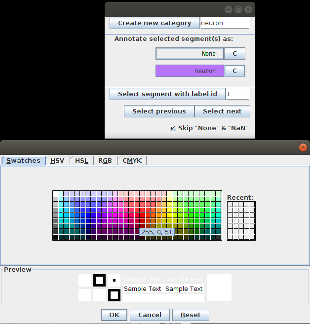
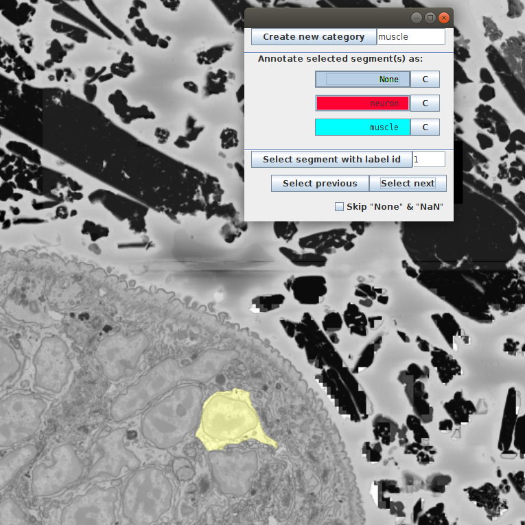
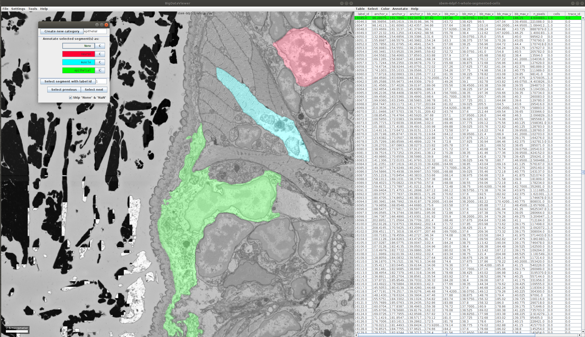
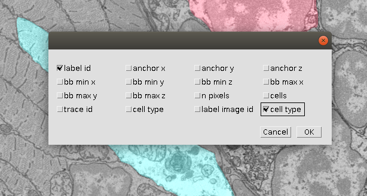
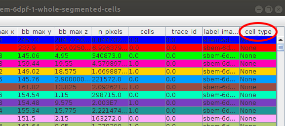
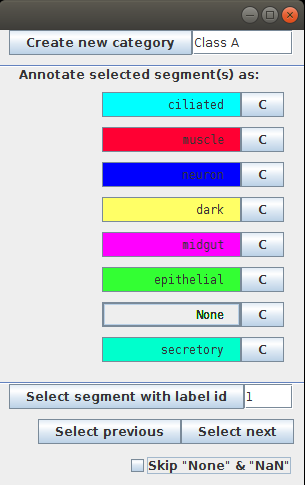

## Annotation tutorial

You can also annotate the segmented objects in your project using MoBIE. You can either do it from scratch or correct an already existing annotation.
There is also [a video](https://youtu.be/M-QUE-Qh97w) demonstrating this functionality.

### Part I. Annotating from scratch

1. To start with, open a project and add the segmentation image you want to annotate. We will use the cell segmentation of the published ['Platybrowser' project](https://github.com/mobie/platybrowser-project) as an example:
    
2. In the segmentation table select Annotate -> Start new annotation... You will be asked to name your annotation. In this example we will annotate cell types, so we name it **cell_type**.
Starting the annotation will add a new column into the segmentation table, where the annotations will be saved. At the moment all the values in the column are **None**:
    
3. After starting the annotation we get a new annotation window, where we can add new categories:
    
To start with, we add two categories: muscles and neurons. The button **C** next to the category name allows to choose a color that will be used to color all the segments of this category:
    
4. To select cells to annotate we have two options:
  *  Navigating with **Select previous** and **Select next** buttons. This will sequentially show you all segments in the table. It is important to unselect the **Skip "None" & "NaN"** since, when selected, it skips all the unannotated segments (in our case **all** the segments).
  We click **Select next** till we see a neuron:
     
  Then we click on **neuron** in the annotation window. This should change the color of the selected cell to red and change the **None** in the table to the selected category - **neuron**:
      
  *  Navigating directly in the BigDataViewer. For this we just scroll through the volume till we see cells we want to annotate. We can select a cell with **[Ctrl + left click]** and click the corresponding category in the annotation window.
5. During the annotation process we can add more categories. For example, here we noticed an epithelial cell, so we add a new category and annotate the cell:
    
6. After we are done, we can save the resulting annotation as follows: in the table click on Table -> Save Columns as.... Here we select the columns we want, in our example we just need the segment id and the cell type, but one can select more features for the further analysis:
    
7. If the annotation was saved with the **label_id** column, it can always be reopened and modified/corrected using MoBIE.

### Part II. Correcting or extending an existing annotation

You can open any annotation of a segmentation image, which was either annotated and saved as described in the previous part, or created as described [here](./viewing_your_own_tables.md).

Important to note that the objects that don't have a label (missing values) can be either excluded from the table (by not including the respective label_ids),
or filled with None or NaN values for categorical and numeric data respectively.

To start annotating:

1. Open a project and add the segmentation image you want to annotate. Again we will use the cell segmentation of the ['Platybrowser' project](https://github.com/mobie/platybrowser-project)
2. Load your annotation using Table -> Load Columns... -> File System, then select the location of your annotation.
This will add additional column/s to the table. We will load the Cell Type annotation created in the previous part:
    
3. Now open the annotation menu by selecting Annotate -> Continue annotation... and select the column you added in the previous step. The annotation menu will show you all the values present in the columns.
You can change the color for each category.
    
4. Selected **Skip "None" & "NaN"** option will skip all the unannotated segments. Use this option to correct the already existing annotation for the annotated segments only.
If you want to annotate new segments, unselect it.
5. Continue the annotation and save it as described in points 4-7 of the previous part.
