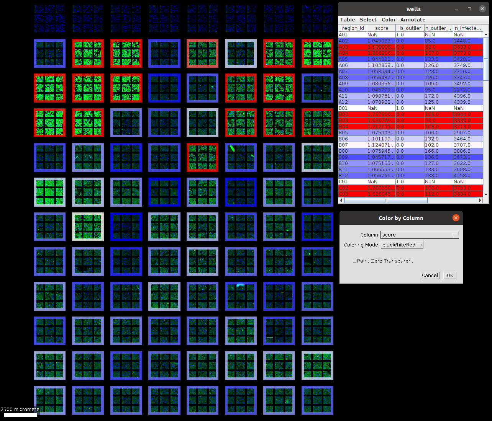
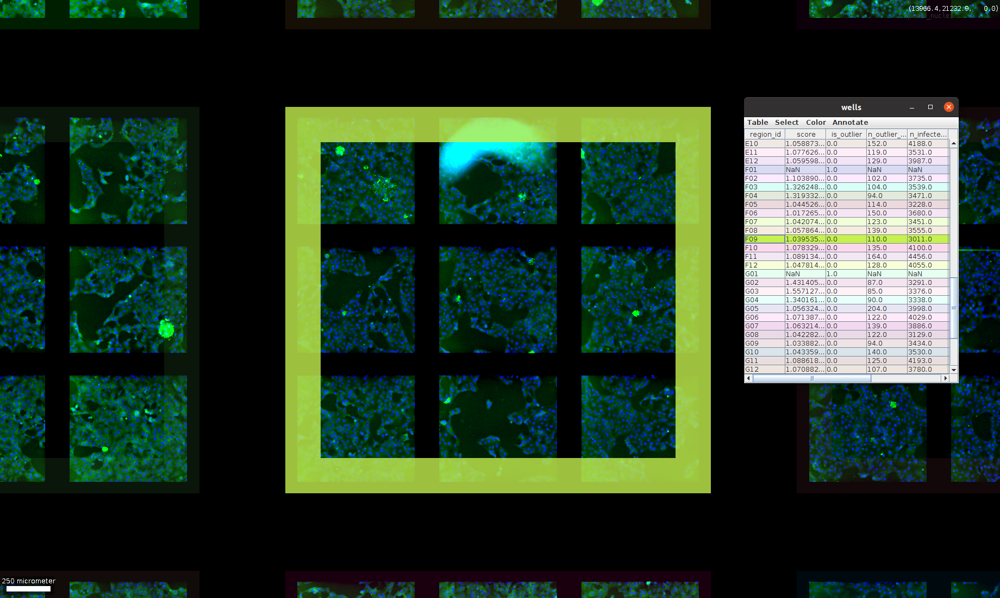
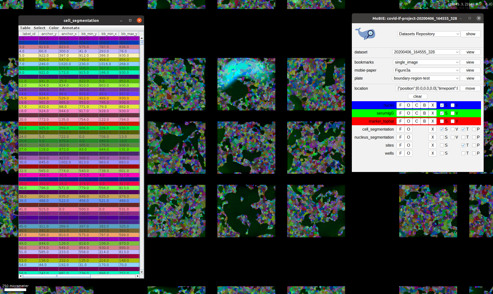

## Grid views and image tables

MoBIE also supports displaying many images at different spatial locations, for example images from high-throughput screening microscopy that are acquired on a multi-well plate.
Here, we will show this functionality based on the MoBIE project at [https://github.com/mobie/covid-if-project](https://github.com/mobie/covid-if-project).

### Grid views

Images can be placed in the global coordinate space using either explicit translations given for each image, or a grid transformation that places them on a regular 2D grid.
Here, we have opened a project that uses nested grid transformations to recreate individual wells (corresponding to small 3x3 image grides each) and the overall plate layout (correspoding to a grid of the 12 x 8 wells):

As a user you can just open and explore projects with grid views. Creating grid views is currently only supported by the [python library](ihttps://github.com/mobie/mobie-utils-python), we are working on also support creating it in the Fiji plugin!

### Image region tables

MoBIE also supports tables associated with image regions. For example, our example project contains the "wells" tabel, where each row corresponds to a well, and the "sites" table, where each row corresponds to an individual image.

The image region tables support the same features as the segmentation tables. Hence, they are very convenient for visualizing image based measurements stored in the table colomns.
For example, coloring the well boundaries based on the "score" column (which contains the final readout of the immunofluorescence assay underlying our example project):

Tables are also very useful for navigation, for example to quickly go to a specific well, via `[Ctrl + Left click]` (selection + navigation) `[Shift + Left click]` (onkly navigation).

And all other features like sorting or searching of the tables, scatter plots or the user annotation modes are supported as well.

### Segmentations

Segmentations for object in the images of the grid can also be loaded, for example here a segmentation of all cells in the plate:

These can also be combined with segmentation tables that contain a row for each segmented cell and can again be used for visualization of analysis results, navigation etc.
