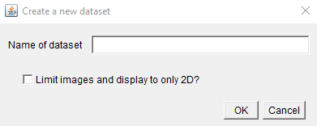

## MoBIE Project Creator

For making projects on your local file system, you can use the MoBIE Project Creator within Fiji.  
**Note**: if your images are particularly large, or you want more control over your project, you can
create your project with our [python library](https://github.com/mobie/mobie-utils-python). See also [here](../specs/mobie_spec.md)
for details about the project specification and structure.

Type MoBIE in the search bar, and select the **Create new MoBIE Project** command.  


Navigate to a folder, and provide a project name.
This will create a new project, and open the **Edit MoBIE Project** dialog.  


**Note:** you can open this at any time by typing MoBIE in the search bar and selecting **Edit MoBIE Project**.

This has 4 rows showing the contents of your project: 'dataset' (datasets in your project), 'source' (images in each dataset), 'group' (the dropdown menu names for this dataset) and 'view' (the individual views in each group).

### Creating datasets

A dataset is a combination of images that can be displayed in the same physical coordinate system e.g.
you might make this images from different samples, or timepoints, or separate experiments.

Click **Add** on the dataset row, and provide a name for your dataset.
Also, select if you want to **Limit images and display to only 2D**. If
you check this box, you will only be able to add 2D images to your dataset,
and when you open them in MoBIE they will be displayed only in 2D.
Uncheck this if you need 3D images, or you want to arrange your 2D images
in 3D space e.g. stacking 2D slices into a 3D stack.  
Clicking **OK** will create the dataset,
and add it to the dataset dropdown.  



The first dataset you create will automatically become the default i.e. the one you see when you first
open that MoBIE Project. To make another dataset the default, select it in the dataset dropdown, then
click **Edit**, and tick the checkbox next to **Make default dataset**.  


This Edit menu also allows you to rename datasets.

### Adding images

To add an image to a dataset, make sure the chosen dataset is selected in the dataset dropdown.
Then follow the directions below for either **open current image** (to add images open in imageJ) or
**bdv format image** (if your image is already in n5 or ome-zarr format).

For all images, make sure your unit and voxel size are set correctly! The project creator only allows images with the same unit to be added to the same project (e.g. all micrometre or all nanometre etc...)

**Note**: if your images are particularly large, it will be more efficient to convert your images outside of
imageJ. e.g. using our [python library](https://github.com/mobie/mobie-utils-python)

#### Current open image

- Open the image you want to add, as you normally would, in imageJ. Make sure the voxel size and unit
are set under Image > Properties... If your image is a time series, you should also set the 'Frame interval' here.
- Click **Add** on the image row and select **current open image**
- Give your image a name, and select the image type and format. (see **Image type** and **bdv format** below for
more details).
- If you deselect 'Use default export settings' you can set the downsampling, chunksize etc manually.
- The 'Make view exclusive' option determines if the final view is 'exclusive' or not. If it is exclusive, then all other images will be removed from the MoBIE viewer, when this is shown.
- You can also **optionally** enter an affine transform for your image - these should be the 'top' three rows of a 4x4 affine matrix, in row major order. Note that this is added **on top** of the shown voxel size scaling.


Once confirmed, you'll be asked to give a 'ui selection group name' - see **Ui selection group** below for details.

The image will then be converted to your chosen image format and saved to the project with the appropriate metadata. If the image was a segmentation,
it will also calculate a corresponding table. This can take some time, especially for large images.
The image will appear in the source/view dropdowns.


#### Add bdv format image

- Click **Add** on the image row and select **bdv format image**
- Select the Add method, image type and bdv format. (see **Image type** and **bdv format** below for
more details)  
- The 'Make view exclusive' option determines if the final view is 'exclusive' or not. If it is exclusive, then all other images will be removed from the MoBIE viewer, when this is shown.
- The 'use filename as image name' option will automatically use the filename as the image name in MoBIE. If you want to set a different name, uncheck this box.


Once confirmed, Select the xml file (if n5), or .ome.zarr directory (if ome-zarr)

Then, you'll be asked to give a 'ui selection group name' - see **Ui selection group** below for details.

The image will be added to the project, and appear in the source/view dropdowns. If the image was a segmentation,
it will also calculate a corresponding table. This can take some time, especially for large images.

For the add method:
- **link to current image location**, this will leave the image where it is, and just link to it inside MoBIE's metadata.
- **copy image**, copies the image into the project
- **move image**, moves the image into the project. Note: Be careful with this, it will delete your image from its original location.

**copy** is the best option in most cases (and will make it easy to upload the project to S3 later).

### Ui Selection Group

Ui selection groups are the names of the dropdown menus inside MoBIE. You can use them to sort your images into different categories - for example, light microscopy and electron microscopy.

If it's not the first image added, you'll have the option to select an existing group, or create a new one.


#### Image type
- **image** is a standard image
- **segmentation** is a label image with segmented objects

#### Bdv format
- **bdv.n5** is bdv n5
- **ome.zarr** is v0.4 ome.zarr

### Open your local project

To open your new project, click the 'Open in MoBIE' button in the bottom
right of the project creator.

### Editing image metadata

Once the project is open in MoBIE, you can change how the images are displayed by default in your views.  

Select the relevant view in the drop down menus and click 'view'. Then setup the view as you like by moving in the MoBIE viewer / changing the colour, brightness etc...

To save these changes you can then right click in the viewer and select 'Save Current Settings As View', and select 'Overwrite existing view' and 'Project'.

The following dialog has all the same settings as [here](./creating_your_own_views.md), with one additional one 'Save location'. Select 'dataset.json' for this.

If you need more complex changes to your views, you will need to manually edit the '.json' files in the project - see [here](../specs/mobie_spec.md) for details of project structure.

### Making your project available remotely

To make a project available to anyone remotely, it will need to be uploaded to an [AWS S3](https://aws.amazon.com/s3/) compatible object store.

First, you must add some metadata to the project by clicking on the 'Add/update remote' button in the bottom right of the project creator.


- **image format** - the image format
- **Signing region** - signing region (this can usually just be left at the default!). It is only necessary for AWS managed object stores - for others, it can be left blank.
- **Service endpoint** - the location of your S3 object store
- **Bucket name** - the name of the bucket inside your S3 object store

Once complete, you can upload the entire project into the specified bucket. Others can then open this, by giving the s3 location (including the bucket) in the 'Open MoBIE Project...' command. For example, try opening the example plankton dataset with this location: https://s3.embl.de/plankton-fibsem

Optionally, if you would like your project metadata to be under version control you can upload it to github - make sure you exclude your image files!! Others can then open the project, by giving the github repository as the location. For example, try opening the example platynereis dataset with this location: https://github.com/mobie/platybrowser-project

In detail:

### S3 upload

Upload the contents of the 'data' directory (the directory containing the project.json file) to the s3 bucket. There are several tools available to achieve this, for example aws s3 sync (https://docs.aws.amazon.com/cli/latest/reference/s3/sync.html). The sync command would look something like this:  
```
$ aws s3 sync /path/to/my/project/data https://s3.embl.de/my-bucket
```

### Add metadata to github

Note that this is optional! It is useful especially for larger projects, with many metadata files, that would benefit from version control.

- Go to https://github.com/ and log into or create your account
- Create a new empty (!) repository, e.g. called "my-mobie-project"
- Go to your local MoBIE project folder in a terminal
- Initialize git via:  
```
$ git init
```
- Add the repository you just created as remote via:  
```
$ git remote add origin https://github.com/USERNAME/my-mobie-project
```
- Tell git to ignore the image data files (n5/ome-zarr files) by creating a file ".gitignore" and adding the lines "\*.n5" and "\*.ome.zarr"
This is very important, because otherwise we would add all the image data to git.
- Add the metadata to git via:  
```
$ git add .
```
- Upload the data to github via:
```
$ git push origin master
```
