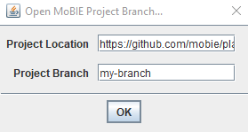
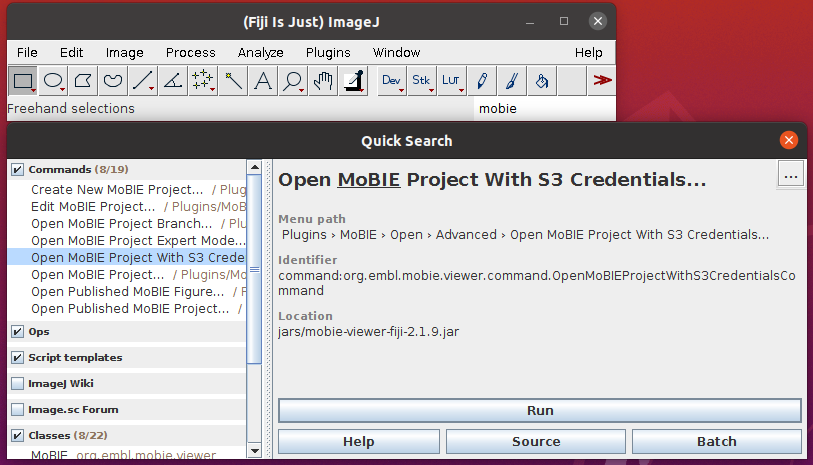

## Opening MoBIE Projects from branches and with credentials

MoBIE projects can also be loaded from different branches of a github repository than `main`. This is useful to test changes before making them directly available in the version of the project that is opened by default.
Furthermore, the S3 bucket containing the project image data may not be public, i.e. it requires credentials to be accessible.
See the two section below for how to open such projects and check out [the expert mode](./expert_mode.md) for how to fully configure the data sources of a MoBIE project.

### Open MoBIE Project Branch

If you want to open a certain github branch of a project, you can use the **Open MoBIE Project Branch** command:

This will open a dialog where you can select the github project location and branch.

### Open MoBIE Project with S3 credentials

To open a MoBIE project from an S3 bucket with credentials, use the **Open MoBIE Project with S3 credentials** command:

This will open a dialog where you can enter the project location (either an S3 address or a github repository) and the S3 access credentials.

