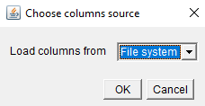

## Importing and exporting tables

You can import tables from your own file system within MoBIE.
For example, this enables you to view your own measurements alongside all the other data of an existing project.

You can also export data from tables within MoBIE, for example to analyze it in a different program or create plots.

### Importing tables

MoBIE contains three different kinds of tables:
- tables associated with a segmentation, which always contain the column **label_id**. This column represents the id (pixel value) of the corresponding segmented object. **label_id** is an integer.
- tables associated with regions (for example positions in a grid-view), which always contain the column **region_id**. This column represents the id of a region and can be an integer or string.
- tables associated with spots (e.g. gene detections in spatial transcriptomics data), which always contain the column **spot_id**. This column represents the id of a spot and is an integer.

The following describes how to prepare tables for the segmentation tables. The process for region and spot tables is analogous, but your table must contain a **region_id** / **spot_id** column instead of the **label_id** column.

#### Making a compatible table

Your table must contain a column **label_id** stating the ids of the relevant segmented objects.
This is the column that will be used to match, and merge your table to the table for the segmentation.

You do not have to list every label id e.g. if you are only interested in a subset of the segmented
objects, you can include those only. Any missing values when your table is merged will be filled
by None (for categorical data) or NaN (for numeric data).

E.g. the table below would be a valid table (but you could add as many additional columns as you'd like):  

Save your table as a .tsv file (both comma-separated and tab-separated are suitable).

#### Viewing your table

To view your table select `Table > Load Columns...` from the menu at the top of
the table. Then, Load Columns from **File System** in the dropdown.

This will create a file browser, where you can select your .tsv file.

Your new columns should now be added to the right side of the table - scroll with the slider
at the bottom of the table to see them.

If you want more control over your tables / want to add many at once, you will have to use
**Expert Mode** - see tutorial [here](./expert_mode.md)

### Exporting tables

You can save tables loaded in MoBIE by selecting `Table > Save Table as...` in the table menu. This will open a dialogue where you specify a file path on your system. The table will be saved there as a tab separated value file.

You can also save only selected columns from a table via `Table > Save Columns as ...`. This will first open a menu where you can select the columns to be saved.
