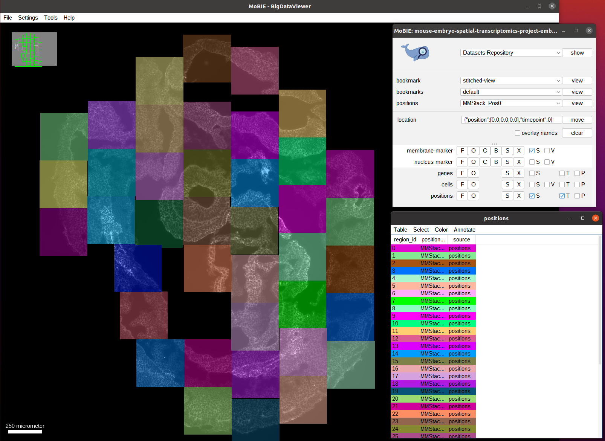
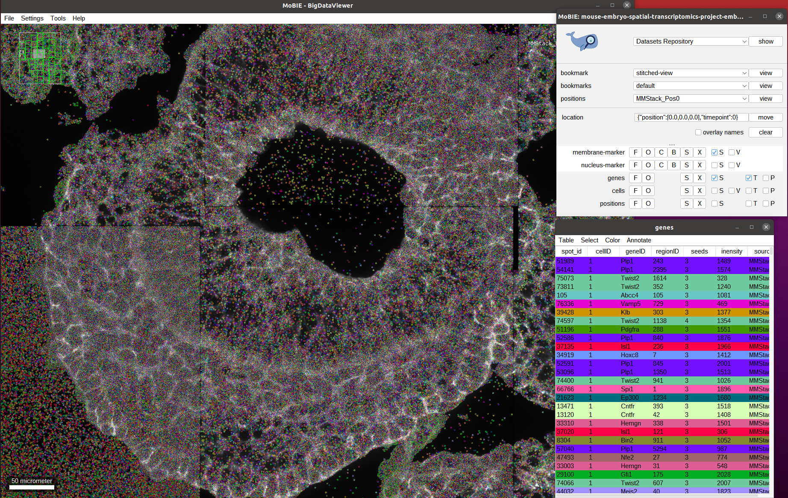
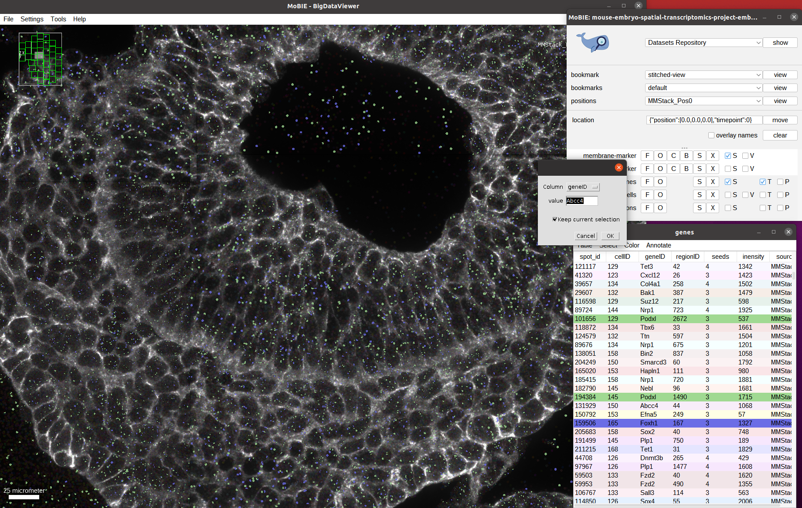
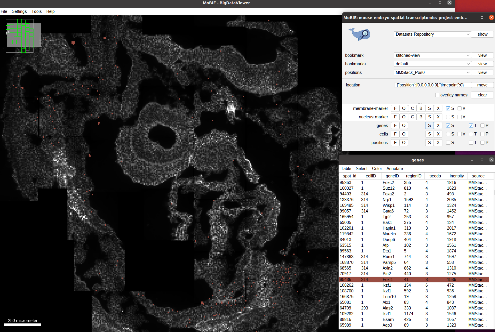
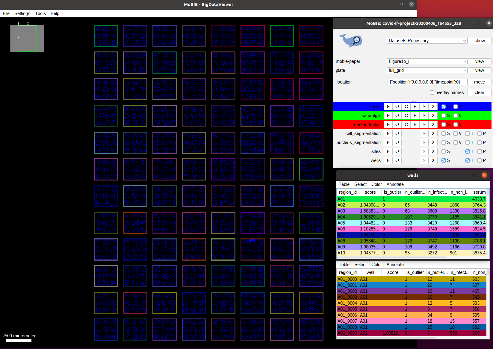

# Spatial transcriptomics

Spatial transcriptomics can measure spatially resolved gene expression in tissue. In combination with microscopy imaging data these gene expression maps enable joint analysis of genotype and phenotype of cells, tissues or organs. MoBIE enables joint visualization of spatial transcriptomics data with imaging data through *spotSources*, which can visualize point coordinates and associated measurements stored in a table.
Here we demonstrate the relevant features for the [mouse-embryo-spatial-transcriptomics-project](https://github.com/mobie/mouse-embryo-spatial-transcriptomics-project).
For this example there is also a [video](https://youtu.be/1dDaxOAZ9Sg) that highlights MoBIE's key features for visualizing spatial transcriptomics data.

## Data & project set-up

The data in this project comes from the publication [Integration of spatial and single-cell transcriptomic data elucidates mouse organogenesis](https://doi.org/10.1038/s41587-021-01006-2), which studies the genetic mechanisms of organ formation in mouse embryos.
The study contains data from three embryos and contains membrane and nucleus channels, decoded gene detections and segmented cells.
We present all of the data for one of the embryos in MoBIE, using the MoBIE python library to create the corresponding MoBIE project (see the scripts in [git repository](https://github.com/mobie/mouse-embryo-spatial-transcriptomics-project) for details.)

Note that this data is also available on [IDR](https://idr.openmicroscopy.org/) (accession id: `idr0138`) and that we access the image data from a mirror of the IDR data set up on the EBI-embassy s3 cloud.

## Exploring the project

Open the project from [https://github.com/mobie/mouse-embryo-spatial-transcriptomics-project](https://github.com/mobie/mouse-embryo-spatial-transcriptomics-project). See ["Getting Started"]("../tutorials/explore_a_prject.md") for how to open a project in the MoBIE Fiji plugin.
The project will open to the `default` view, which shows just one of the tile positions of the embryo. (This is done in order to open the project fast.)
We switch to the view `stitched-view` to see the full embryo. Note that this will take a while since this view contains many spots (corresponding to the gene detections).
    

Here, each colored position corrpesonds to a tile (annotated through a `RegionDisplay`). The tiles are placed at their correct positions using affine transformations specified in the view. And we can see the membrane channel as the only data that is initially visible.
Let's explore the available data and zoom into one of the tiles:
    

Next, we activate the `genes` layer, which will show each decoded gene detection with a spot in the image:
    

As you can see we have very many spots (11 million for the whole embryo). Since they are all loaded at once analyzing them visually is challenging.
We can for example select spots interactively from the table or image, just as for segmentations or regions:
    

We can also select all spots corresponding to certain genes using the table, via `Select->Select Equal To...` in the `genes` table. And then choosing `Column: geneID` and entering the gene name in the `value` field. If `Keep current selection` is marked the spots that are already selected will stay active, if not they will be deselected.
Below screenshot shows all spots for the two genes `Podxl` and `Foxh1` selected, and the selection menu with the settings to add the ones corresponding to `Abcc4` open: 
    

This feature is especially useful to see the spatial distribution of one or several genes, see for example the distribution for `Foxf1` below.
    

While these features enable visual inspection and qualitative analysis of the gene expression spots, quantitative analysis is best done in a specialized external tool.
By supporting import and export of tabular data MoBIE can then load these analysis results to help visualize them in full spatial context. See [importing and exporting tables]("../tutorials/importing_and_exporting_tables.md") for more details. 

<!--- Don't have access to these clusterings right now.
Here, we visualize one of the main analysis results from the original publication, the gene based clustering of segmented cells:
First let's see the cell segmentation by activating the `cells` layer:
    

As you can see, the segmentation was done per tile, and we also have some ids that correspond to the background.

Now, let's load the clustering result. It is stored in the `xxx` column of the `cells` table and we can visualize it by selecting `Color->Color by Column...` and then entering `Column: xxx`, `Color by Column: glasbey` in the menu that opens:
    
-->
