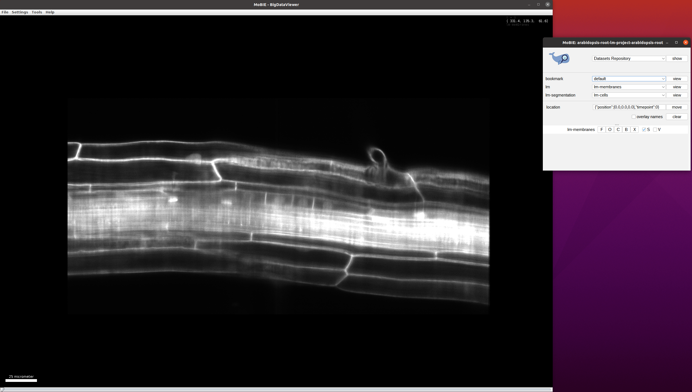
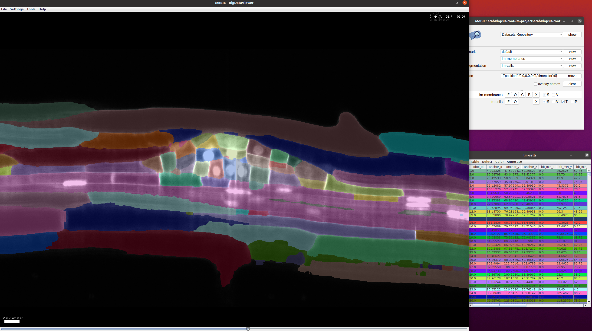
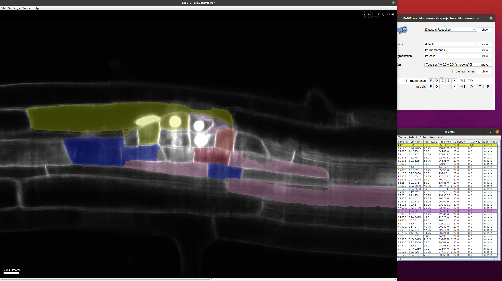
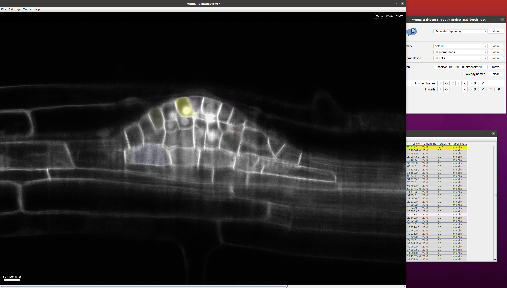

# 3D light microscopy timeseries

Light-microscopy images or volumes taken over time are commonly used to study dynamical problems, for example in developmental biogly.
Here we showcase the [arabidopsis-root-lm-project](https://github.com/mobie/arabidopsis-root-lm-project) that visualizes a timeseries of a growing *Arabidopsis thaliana* root imaged with lightsheet microscopy.
For this example there is also a [video tutorial](https://youtu.be/Md4PbK50NE0) that highlights MoBIE's key features for visualizing timeseries.

## Data & project set-up

The data for this project comes from the publication [Accurate and versatile 3D segmentation of plant tissues at cellular resolution](https://elifesciences.org/articles/57613).
It contains a timeseries of lightsheet volumes with a cell membrane and nucleus channel, as well as a derived cell segmentation and lineage tracking for selected cells. The cell segmentaiton was produced with [PlantSeg](https://github.com/hci-unihd/plant-seg), the tracking with [MaMuT](https://imagej.net/plugins/mamut/).

The data from the original publication was converted to the MoBIE data format using the [MoBIE python library](https://github.com/mobie/mobie-utils-python/tree/master/mobie/htm), which is called in [this script](https://github.com/mobie/arabidopsis-root-lm-project/blob/main/create_project.py). 
The project metadata is stored on [github](https://github.com/mobie/arabidopsis-root-lm-project) and the image data is stored on the EMBL S3 server.

## Exploring the project

One of the most common ways to analyze timeseries data is to track cells over time, for example to study developing organisms on a cellular level.
Here we demonstrate how cell tracking results can be visualized in MoBIE.

Open the project from [https://github.com/mobie/arabidopsis-root-lm-project](https://github.com/mobie/arabidopsis-root-lm-project). See ["Getting Started"]("../tutorials/explore_a_prject.md") for how to open a project in the MoBIE Fiji plugin.
The project will open to the default view, which shows the middle of the volume at timepoint 0:
    

Add the cell segmentation to the viewer (`lm-segmentation->lm-cells->view`).
Use the scrollbar (bottom) to move through time and go to a timepoint where the primordial root (smaller cells in the middle) is visible:
    
This view can be loaded in MoBIE via `bookmarks->use-case1->view`.

Find the cells which have beent tracked. For this, select `Color->Color by Column` in the `lm-cells` table and then select `Column:track_id, Coloring Mode: glasbey, Paint Zero Transparent` in the following menu. After this, only the cells with tracks will be highlighted in the image and table and their color will change based on the `track_id`:
    
This view can be loaded in MoBIE via `bookmarks->use-case2->view`.

Choose a `track_id` that you want to follow through time (e.g. by selecting a cell in the image and reading the corresponding `track_id` from the table).
To easily follow a given track through time you can select all cells with a given `track_id` by clicking `Select->Select Equal To ...` in the table menu.
In the following menu enter `Column:track_id` and `value:14` (here 14 is just an example `track_id`, you can choose another one to follow a different track).
This will select all cells through time with that `track_id`: when scrolling through time you will see that the cells along the given track are selected:
    
This view can be loaded in MoBIE via `bookmarks->use-case3->view`.
